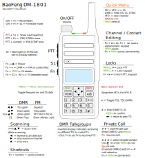
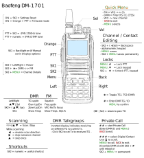

# OpenGD77 User Guide

## For OpenGD77 / OpenGD77S / OpenDM1801* / OpenDM1801A* / OpenRD5R / MD-9600 (RT-90) / MD-UV380 (RT-3S) / MD-UV390 / DM-1701 / RT-84

For the latest information and discussions, please refer to the development and community forum at <https://opengd77.com>

# The firmware is also NOT compatible with the new 2022 version of the Baofeng DM-1801, or the new DM-1801A #

<!-- TOC titleSize:2 tabSpaces:2 depthFrom:1 depthTo:6 withLinks:1 updateOnSave:1 orderedList:0 skip:0 title:1 charForUnorderedList:* -->

## Table of Contents
* [OpenGD77 / OpenGD77S / OpenDM1801* / OpenDM1801A* / OpenRD5R / MD-9600 (RT-90) / MD-UV380 (RT-3S) / DM-1701 / RT-84 User Guide](#for-opengd77--opengd77s--opendm1801--opendm1801a--openrd5r--md-9600-rt-90--md-uv380-rt-3s--md-uv390--dm-1701--rt-84)
  * [Introduction](#introduction)
    * [Download links and other resources](#download-links-and-other-resources)
  * [Installation](#installation)
  * [Transferring data to Radio](#transferring-data-to-radio)
  * [Codeplug compatibility](#codeplug-compatibility)
  * [Variations between different supported radios](#variations-between-different-supported-radios)
  * [Main screens (VFO and Channel modes)](#main-screens-vfo-and-channel-modes)
    * [Changing between FM mode and DMR mode](#changing-between-fm-mode-and-dmr-mode)
    * [Changing Timeslot in DMR mode](#changing-timeslot-in-dmr-mode)
    * [Automatic setting of Talkgroup/PrivateCall and Timeslot in DMR mode](#automatic-setting-of-talkgroupprivatecall-and-timeslot-in-dmr-mode)
    * [Changing bandwidth in FM mode](#changing-bandwidth-in-fm-mode)
    * [Controlling Tx power](#controlling-tx-power)
    * [Signal strength bar graph](#signal-strength-bar-graph)
    * [Channel screen specific functionality](#channel-screen-specific-functionality)
      * [Changing channels within the current zone](#changing-channels-within-the-current-zone)
      * [Changing zones](#changing-zones)
      * [Displaying the channel Frequency](#displaying-the-channel-frequency)
      * [Displaying FM specific channel information](#displaying-fm-specific-channel-information)
      * [Reverse repeater operation](#reverse-repeater-operation)
    * [Channel Quick Menu](#channel-quick-menu)
      * [Copying a channel to VFO](#copying-a-channel-to-vfo)
      * [Read the VFO into the current channel](#read-the-vfo-into-the-current-channel)
      * [Filters (Channel)](#filters-channel)
      * [Talkaround](#talkaround)
      * [Roaming](#roaming)
    * [VFO Quick Menu](#vfo-quick-menu)
      * [VFO selection A or B](#vfo-selection-a-or-b)
      * [Exchange the TX and RX frequencies](#exchange-the-tx-and-rx-frequencies)
      * [Copy the RX frequency to the TX frequency](#copy-the-rx-frequency-to-the-tx-frequency)
      * [Copy TX frequency to the RX frequency](#copy-tx-frequency-to-the-rx-frequency)
      * [Filters (VFO)](#filters-vfo)
      * [VFO to New Channel](#vfo-to-new-channel)
      * [Tone Scan for CTCSS or DCS tone in FM](#tone-scan-for-ctcss-or-dcs-tone-in-fm)
      * [Dual Watch](#dual-watch)
      * [Freq Bind](#freq-bind)
    * [DMR specific functionality (VFO and Channel screens)](#dmr-specific-functionality-vfo-and-channel-screens)
      * [Timeslot selection](#timeslot-selection)
      * [DMR ID callsign and name display](#dmr-id-callsign-and-name-display)
      * [Talker Alias display](#talker-alias-display)
      * [Talkgroup selection from the TG list](#talkgroup-selection-from-the-tg-list)
      * [Assignment of Timeslot to Digital Contact TalkGroup](#assignment-of-timeslot-to-digital-contact-talkgroup)
      * [TalkGroup displayed in inverse video](#talkgroup-displayed-in-inverse-video)
      * [Manual TalkGroup number entry](#manual-talkgroup-number-entry)
      * [Private Call number entry](#private-call-number-entry)
      * [Digital Contact selection](#digital-contact-selection)
      * [Station DMR ID number entry](#station-dmr-id-number-entry)
    * [FM specific functionality (VFO and Channel screens)](#fm-specific-functionality-vfo-and-channel-screens)
      * [FM and FM Narrow](#fm-and-fm-narrow)
      * [CTCSS Tone or DCS Code](#ctcss-tone-or-dcs-code)
      * [Squelch](#squelch)
      * [1750Hz Tone for repeater operation](#1750hz-tone-for-repeater-operation)
      * [DTMF tone transmission](#dtmf-tone-transmission)
      * [DTMF sequence entry and transmission](#dtmf-sequence-entry-and-transmission)
      * [FM APRS location transmission](#fm-aprs-location-transmission)
    * [VFO specific functionality](#vfo-specific-functionality)
      * [Frequency change up/down step](#frequency-change-updown-step)
      * [Numerical frequency entry](#numerical-frequency-entry)
      * [To adjust the TX frequency, independent of the RX frequency](#to-adjust-the-tx-frequency-independent-of-the-rx-frequency)
      * [Spectrum sweep scan](#spectrum-sweep-scan)
      * [VFO Dual Watch](#vfo-dual-watch)
  * [Monitor mode](#monitor-mode)
  * [Transmitting](#transmitting)
    * [Timeout warning beep](#timeout-warning-beep)
    * [TOT](#tot)
  * [Scanning](#scanning)
    * [Channel scanning](#channel-scanning)
    * [VFO scanning](#vfo-scanning)
  * [Other screens](#other-screens)
    * [Lock screen](#lock-screen)
    * [Text entry](#text-entry)
  * [The control keys and buttons](#the-control-keys-and-buttons)
  * [The Menu System](#the-menu-system)
  * [QuickKeys](#quickkeys)
  * [Main Menu](#main-menu)
    * [Zone](#zone)
    * [RSSI](#rssi)
    * [Radio info](#radio-info)
      * [Battery voltage and percentage](#battery-voltage-and-percentage)
      * [Time clock](#time-clock)
      * [Date screen](#date-screen)
      * [Location screen](#location-screen)
      * [CPU Temperature](#cpu-temperature)
      * [Battery voltage history](#battery-voltage-history)
    * [Contacts](#contacts)
      * [DMR Contacts](#dmr-contacts)
      * [FM DTMF Contacts](#fm-dtmf-contacts)
      * [New Contact](#new-contact)
    * [Last Heard](#last-heard)
    * [Firmware Info and credits](#firmware-info-and-credits)
    * [Options **(contains the 8 following options screens)**](#options)
        * [General Options](#general-options)
          * [Key long](#key-long)
          * [Key rpt](#key-rpt)
          * [Auto lock](#auto-lock)
          * [Hotspot](#hotspot)
          * [Temp Cal](#temp-cal)
          * [Batt Cal](#batt-cal)
          * [Eco Level](#eco-level)
          * [Suspend](#suspend)
          * [Safe Pwr-On](#safe-power-on)
          * [APO](#apo-auto-power-off)
          * [APO with RF](#apo-with-rf)
          * [Sat (Satellite follow mode)](#sat-satellite-follow-mode)
          * [GPS](#gps)
          * [Locked](#locked)
        * [Radio Options](#radio-options)
          * [Band Limits](#band-limits)
          * [TX Inhibit](#tx-inhibit)
          * [Filter time](#filter-time)
          * [Scan delay](#scan-delay)
          * [Scan dwell](#scan-dwell)
          * [Scan mode](#scan-mode)
          * [Scan on Boot](#scan-on-boot)
          * [VHF Squelch](#xxx-squelch)
          * [200 Squelch](#xxx-squelch)
          * [UHF Squelch](#xxx-squelch)
          * [PTT Latch](#ptt-latch)
          * [Allow PC](#allow-pc)
          * [User Power](#user-power)
          * [DMR crc](#dmr-crc)
          * [Mode](#mode)
        * [Display Options](#display-options)
          * [Brightness](#brightness)
          * [Nite Bright](#nite-bright)
          * [Min Bright](#min-bright)
          * [Contrast](#contrast)
          * [Mode](#mode)
          * [Timeout](#timeout)
          * [Screen](#screen)
          * [Auto night](#auto-night)
          * [Order](#order)
          * [Contact](#contact)
          * [Time](#time-in-header)
          * [Battery (units)](#battery-units)
          * [Info](#info)
          * [Volume](#volume)
          * [LEDs](#leds)
          * [Timezone](#timezone)
          * [UTC](#utclocal-time-display-format)
          * [Show dist](#show-distance)
        * [Sound Options](#sound-options)
          * [Timeout beep](#timeout-beep)
          * [Beep volume](#beep-volume)
          * [DMR Beep](#dmr-beep)
          * [RX Beep](#rx-beep)
          * [Talker](#talker)
          * [DMR mic](#dmr-mic)
          * [FM mic](#fm-mic)
          * [VOX threshold](#vox-threshold)
          * [VOX Tail](#vox-tail)
          * [Prompt](#prompt)
          * [DMR Rx AGC](#dmr-rx-agc)
          * [Click suppr](#click-suppr)
        * [Radio Calibration](#calibration-screen)
        * [Language](#language)
        * [Theme Options](#theme-options)
          * [Theme chooser](#theme-chooser)
          * [Theme options](#theme-options)
          * [Colour Picker](#colour-picker)
          * [Theme Items](#here-is-the-detailed-list-of-the-theme-items)
        * [APRS Options](#aprs-options)
          * [Mode](#beaconing-mode)
          * [Location](#beaconing-location)
          * [Interval](#beaconing-initial-interval)
          * [Decay](#beaconing-decay-algorithm)
          * [Compress](#beaconing-compression)
          * [SmartBeaconing&trade;](#smartbeaconing)
            * [Slow Rate](#slow-rate)
            * [Fast Rate](#fast-rate)
            * [Low Speed](#low-speed)
            * [Hi Speed](#high-speed)
            * [Turn Angle](#turn-angle)
            * [Turn Slope](#turn-slope)
            * [Turn Time](#turn-time)
    * [Channel Details](#channel-details)
      * [Channel name](#channel-name)
      * [RX](#rx)
      * [TX](#tx)
        * [Repeater Shifts](#repeater-shifts)
      * [Mode](#mode)
      * [Location](#location)
      * [Lat](#lat)
      * [Lon](#lon)
      * [DMR ID](#dmr-id)
      * [Color Code](#color-code)
      * [Timeslot](#timeslot)
      * [TG Lst](#tg-lst)
      * [Contact](#contact-1)
      * [Rx CSS](#rx-css-ctcss-or-dcs)
      * [Tx CSS](#tx-css-ctcss-or-dcs)
      * [BW](#bw)
      * [Step](#step)
      * [TOT](#tot)
      * [Rx Only](#rx-only)
      * [Zone Skip](#zone-skip)
      * [All Skip](#all-skip)
      * [VOX](#vox)
      * [Ch Power](#ch-power)
      * [Squelch](#squelch-channel)
      * [Beep](#beep-channel)
      * [Eco](#eco-channel)
      * [TA Tx TS1](#ta-tx-tsx)
      * [TA Tx TS2](#ta-tx-tsx)
      * [APRS](#aprs-channel)
      * [Force DMO](#force-dmo)
      * [Accepting and saving the changes to the channel](#accepting-and-saving-the-changes-to-the-channel)
    * [Satellite Screen](#satellite-screen)
      * [Polar view](#polar-view)
      * [Satellite individual predictions screen](#satellite-individual-predictions-screen)
      * [Satellite live data screen](#satellite-live-data-screen)
      * [Squelch and Power settings](#squelch-and-power-settings)
      * [Satellite alarm](#satellite-alarm)
      * [CPS Integration](#cps-integration)
      * [Technical notes](#technical-notes)
    * [GPS Screen](#gps-screen)
  * [Making and receiving DMR Private Calls](#making-and-receiving-dmr-private-calls)
    * [To make a Private Call](#to-make-a-private-call)
    * [To Receive a Private Call](#to-receive-a-private-call)
  * [Hotspot mode](#hotspot-mode)
  * [Resetting the Settings](#boot-key-combinations)
  * [Boot key combinations](#boot-key-combinations)
  * [GD-77S operation](#gd-77s-operation)
    * [GD77S Channel/TG mode](#gd77s-channeltg-mode)
    * [GD77S Scan mode](#gd77s-scan-mode)
    * [GD77S Timeslot mode](#gd77s-timeslot-mode)
    * [GD77S Color Code mode](#gd77s-color-code-mode)
    * [GD77S DMR Filter mode](#gd77s-dmr-filter-mode)
    * [GD77S Zone mode](#gd77s-zone-mode)
    * [GD77S Power mode](#gd77s-power-mode)
  * [MD-9600 and RT-90 specific](#md-9600-and-rt-90-specific)
  * [CPS software](#cps-software)
    * [Overview](#overview)
      * [New Driver Installation](#new-driver-installation)
      * [OpenGD77 Menu](#opengd77-menu)
      * [IMPORTANT FIRST STEP: Backup First](#backup-before-you-do-anything-else)
      * [Reading and Writing Your Codeplug](#reading-and-writing-your-codeplug)
      * [Writing DMR IDs -- the User Database](#writing-dmr-ids----the-user-database)
      * [Boot Tune](#boot-tune)
        * [Boot Tune in Morse code](#boot-tune-in-morse-code)
      * [Melodies and Notes](#melodies-and-notes)
      * [Boot Image](#boot-image)
<!-- /TOC -->

## Introduction

This user guide is a work in progress as is the firmware.

The photos will be updated when the firmware in a particular area stabilises.

The intention of the project is to create a fully featured non-commercial firmware that entirely replaces the factory firmware.
This firmware is specifically designed for **Amateur Radio** use, and has features not available in the official firmware.

*Notes:*

- **The firmware is still under development and there are some key areas of functionality which are supported in the official firmware but not in this firmware**
- SMS message Tx and Rx **are not currently supported**, but may be supported in the future.
- Scan Lists **are not supported** because Channel or Zone scan feature provides almost identical functionality.
- Privacy and Encryption **will never** be supported, as it's illegal for Amateur Radio use, developers in some countries (*e.g.* Australia) are now legally required to put a back door access into any encryption systems at the request of the government, hence effectively making it illegal or impossible to develop systems that contain encryption.

### Download links and other resources

For software licensing reasons the OpenGD77 firmware needs to include parts of the original manufacturer's firmware to provide support for AMBE voice encoding and decoding.
Depending on your radio type you will need to download and extract one of the following two 'Donor' files, store it on your computer and make a note of its location.

**Donor File for GD-77 | GD-77S | DM-1801 | DM-1801A | RD-5R**

<https://radioddity.s3.amazonaws.com/2021-01-26%20GD-77%20CPS%20%26%20Firmware%20Changelog%20-%20Ham%20Version.zip>

Unzip the donor firmware zip file, extract the 'GD-77_V4.3.6.sgl' file from the "Firmware software V4.3.6" folder and save it to your computer.

Note, this file is the same for all of the radio types above.

**Donor File for TYT MD-9600 | Retevis RT-90 | TYT MD-UV380 | Retevis RT-3S | Baofeng DM-1701 | Retevis RT-84**

<https://www.passion-radio.com/index.php?controller=attachment&id_attachment=760>

Unzip the donor firmware zip file, extract the donor file 'MD9600-CSV(2571V5)-V26.45.bin' and save it to your computer.

Note, this file is the same for all of the radio types above.

**Firmware binaries:**

**GD-77 | GD-77S | DM-1801 | DM-1801A | RD-5R**
<https://www.opengd77.com/downloads/GD77/Firmware/Latest>

**TYT MD-9600 | Retevis RT-90**
<https://www.opengd77.com/downloads/MD9600/Firmware/Latest>

The MD-9600 | RT-90 has been produced with multiple different PLL and IF chips during its production run.
You need to install the version which matches your hardware version
The version is written on the PCB inside the top of the radio, except sometimes TYT changed the hardware without changing the version on the PCB.
For radios with hardware version 4A use Version 5 firmware
For very old radios with hardware version 2 written on the PCB, may need to be loaded with Version 1 firmware.

No harm will be done if you load the wrong firmware version. However the radio will not receive or transmit.
So basically if your radio does not receive or transmit, try a different firmware hardware version.

**TYT MD-UV380 | Retevis RT-3S | Baofeng DM-1701 | Retevis RT-84**
<https://www.opengd77.com/downloads/MDUV380_DM1701/Firmware/Latest/>

*Note*:

- Versions with JA in the name are localised for Japanese users and only support Japanese and English languages

- **OpenGD77 CPS**
<https://www.opengd77.com/viewtopic.php?f=12&t=3877>

- **Latest Source code for fully released firmware:**
<https://www.opengd77.com/downloads/releases>

- **OpenGD77 Forum:**
<https://www.opengd77.com/>

## Installation

The firmware can be installed onto the following radios

- Radioddity GD-77 (also known as TYT MD-760)
- Radioddity GD-77S
- Baofeng DM-1801 - VERSION 1 HARDWARE ONLY (also known as Baofeng DM-860)
- Baofeng DM-1801A - VERSION 1 HARDWARE ONLY
- Baofeng RD-5R (also known as Baofeng DM-5R Tier 2)
- TYT MD-9600 | Retevis RT-90
- TYT MD-UV380 | Retevis RT-3S | Baofeng DM-1701 | Retevis RT-84

The firmware must be installed using the 'Extras/Firmware Loader' menu in the OpenGD77 CPS. The original Manufacturers' firmware loader cannot be used to load the OpenGD77 firmware.

Installation of the firmware is undertaken at the owner's own risk, but the official firmware can usually be reloaded onto the radio if the user has problems with the firmware, **as long as the operator takes a full backup of their radio using the OpenGD77 CPS immediately after the firmware has been installed** (see [*backup section*](#backup-before-you-do-anything-else))

*Notes:*

- *The firmware is not compatible with the new 2022 version of the Baofeng DM-1801 or DM-1801A which now uses completely different internal hardware and electronics*
- The official Radioddity CPS PC software is not compatible with the firmware, and the **OpenGD77 CPS** must be used instead. This can be downloaded from the link shown in [section 1.1](#download-links-and-other-resources) of this guide. This CPS must also be used for the Baofeng , TYT, Retevis and all other supported radios

### Transferring data to Radio

The CPS must be used to install the firmware and also to read and write the codeplug, and write the satellite data, voice prompts and DMR ID database.

1. Firmware upgrade.
  * Get the radio into firmware update mode by:
  
    * Holding down the two buttons indicated below (**S1**,**Fn**) and turn the radio on.
	
      * Radioddity GD-77 or GD-77s or the TYT MD-760 or MD-730:
        * Hold down the **two small buttons** next to the PTT button.
      * Baofeng DM-1801 or DM-1801A or DM-860:
        * Hold down the **two small buttons** under the PTT button.
      * Baofeng RD-5R or DM-5R Tier2:
        * The Orange **S1** (Call) and Black Fn (**Moni** or **S2**) buttons (either side of the PTT).
      * TYT MD-9600 | Retevis RT-90
        * Hold buttons P1 and orange button, while applying 12V power to the radio. Note updating the OpenGD77 firmware to a newer version does not require the power to be removed and reconnected, just turn on the radio using the green / power button whilst holding P1 and orange will enter firmware update mode.
      * TYT MD-UV380 | Retevis RT-3S | Baofeng DM-1701 | Retevis RT-84
        * Hold the top 2 buttons on the side of the radio (**S1** and PTT) and turn the radio on.

		
<!-- { width=420 } -->

  * The LCD screen will be blank. Handheld radios the LED will be illuminated or flash.

  * For GD-77 | GD-77S | DM-1801 | DM-1801A and RD-5R no driver is required. 
	For all other radios the STM DFUSe driver is required. If the driver is not automatically installed by Windows, you may need to use the Windows Device Manager to find and install the correct driver.
  
  * Select the radio type
  
  
  
  * The Firmware is easily installed from the Extras menu in the [CPS](#cps-software).  
    <!-- { width=400 } -->

    - Choose your radio model.  
      <!-- { width=420 } -->  
      <!-- { width=420 } -->

    - For Software licensing reasons the first time that you use the firmware loader you must click 'Select official firmware (donor) file' and then select the donor file you previously downloaded.

      It is only necessary to do this once. If you do not do this then it is only possible to use the radio in FM mode.

      **Note!  Do not attempt to install the Manufacturer's official firmware to the radio, it is only needed by the CPS to add DMR functionality to the firmware.**

      Once you have successfully completed this procedure the Title bar of the Firmware Loader will display [+DMR]

    - The firmware can optionally support an additional language. Select this in the 'Additional Language' dropdown menu if you need it.
    - Click 'Select Open firmware file & Update' or 'Select a File and Update'
    - Select a previously downloaded .zip firmware file. (The most recent file can be found at the download location given in [section 1.1](#download-links-and-other-resources))
      The Selected Firmware file will be patched with data from the official firmware and then downloaded to the radio along with the additional language if selected.
    - When the download is complete, if the radio does not automatically reboot, turn the power off and on again.
	
 **Note! The codeplug format used in all radios except the GD-77 is not supported by the firmware, so you will need to install an OpenGD77 format codeplug using the CPS before you can any functions of the radio, except the VFO - which can be changed manually**

2. Updating the codeplug using [OpenGD77 CPS](#cps-software).
  - This mechanism uses serial communication while the radio is normally on with the LCD active.
    * If you have been updating the firmware then turn the radio off and turn it on normally.
    * It uses serial ports so the OpenGD77 driver must be installed. This happens as part of the installation of the CPS software.
    * Specific Detail in [CPS section](#backup-before-you-do-anything-else)

## Codeplug compatibility

The official firmware for each of these radios use slightly different codeplug formats.

To make the best use of the features of OpenGD77 we recommend that you write a new codeplug for the radio using the OpenGD77 CPS.

The OpenGD77 CPS also has the ability to import an existing codeplug from .CSV files.

The codeplug can only be uploaded to the firmware using the [OpenGD77CPS](#cps-software).

It's also recommended that you structure your codeplug to remove any duplicate channels which are the same frequency but use different TalkGroup. See the section about [*Programming Channels and Talkgroups for use with the firmware*](#overview) at the end of this User Guide.

## Variations between different supported radios

Not all the supported radios have the same number of buttons, or the same screen size, hence there are some differences when operating radios other than the Radioddity GD-77.

Also, not all radios support all the functionalities.

- The Radioddity GD-77 (aka *TYT MD-760*), has 2 buttons below the PTT. The **black** button is technically known as **SK1**, and the **blue** button is known as **SK2** and is also referred to, in this manual, as the **Function** button. This radio also has an **Orange** button at the top.
- The Baofeng RD-5R | DM-5R USB hardware will not support USB connections while the radio is transmitting, so **it is not possible** to use Hotspot mode on this radio.
- The Baofeng RD-5R | DM-5R does not have Left or Right arrow buttons, so the **A/B** button is used to replace the Left arrow and the **Band** button is used to replace the Right arrow.
- The Baofeng RD-5R | DM-5R does not have the **Orange** button, and its functionality has been simulated by using a **Long press** on the orange coloured **MR/VFO** button.
- The Baofeng RD-5R | DM-5R has 2 buttons on the side, but their position is different from the GD-77 and DM-1801. The button above the PTT is used as the **Black** button on the side of the GD-77, also known as button **SK1**. The button below the PTT is used as the **Function** button, also known as **SK2**.
- The Radioddity GD-77S does not have a keypad or screen, hence its operation is completely different from the other supported radios that have a screen (*see the appendix on [GD-77S operation](#gd-77s-operation)*).
- The Baofeng DM-1801 | DM-860 has a dedicated **MR/VFO** button, which is used to change between Channel and VFO mode, in place of pressing the **Red** menu key.
- The Baofeng DM-1801 | DM-860 has a dedicated **A/B** button, which is used to change between VFO A and B, in place of pressing the quick menu via the **Orange** button on the top of the radio.
- The TYT MD-UV380 | Retevis RT-3S does not have Right and Left arrow buttons, but has a rotary control on top of the radio. On the VFO and Channel screens, the **Up** and **Down** buttons function like the Right and Left button on the GD-77. The rotary control operates functions like the **Up** and **Down** buttons on the GD-77 and can be used to change channel or VFO frequency.
- The Baofeng DM-1701 | Retevis RT-84 does not have the Right and Left array buttons, P1 is used as Left button, P2 is used as Right button. The **Orange** button is located above the PTT.
In menu screens the **Up** and **Down** buttons move up and down and the rotary control is used to control the value of each setting, in the same way that the Left and Right buttons do on the GD-77
- The TYT MD-9600 | Retevis RT-90 is a mobile radio with buttons on the front panel and the microphone. See the section about the MD-9600 for information about key and button mappings.

## Main screens (VFO and Channel modes)

The firmware has 2 main screens, the VFO screen and the Channel screen. These are similar to the Channel and VFO screens in the official firmware, except having additional functionalities.

Initially after the firmware is installed, the VFO screen will be displayed.

The frequency used in the VFO for both Tx and Rx will be read from the *VFO A* settings of the codeplug.

On both the VFO and Channel screens, the mode (**DMR** or **FM**) is shown in the top left of the display, and the battery voltage or percentage is shown in the top right of the display.

In **DMR** mode, the current *TimeSlot* is shown to the right of the **DMR** text, *e.g.* **TS2** for TimeSlot 2, and the *Color Code*, *e.g.* **C1** for Color Code 1, is shown to the left of the battery voltage / percentage. When TimeSlot filtering is turned off, the **TS1** or **TS2** indicator is in inverse colour.

The current Tx power is shown in the middle of the top of the screen (*e.g.* 750mW).

On the **VFO** screen, the TX and RX frequencies are shown, as well as the TalkGroup when in DMR mode.

The arrow to the left of the **R** (receive frequency) indicates that the keypad **Up** and **Down** arrows and number entry keys will control the RX frequency.

The channel screen displays the same information in the top row, but displays the **Channel name** (in this example __*Lee Hill*__) as well as the **Zone** (__*Home DMR*__).

In DMR mode the **TalkGroup** (in this case __*ColoradoHD*__), will also be displayed.

On both the VFO and Channel screens:

- Press the **Red** menu button to toggle between the VFO and Channel screens (*Note:* on radios like the Baofeng DM-1801 and RD-5R, press the **MR/VFO** button to toggle between Channel and VFO mode).
- Press the **Green** menu key to enter the menu system.
- Press **Function + Green** for quick access to the [Channel details](#channel-details) screen, which can also be accessed via the menu system.

*Note:*

- The VFO is actually a special type of Channel; hence the [Channel Details](#channel-details) screen also works for the VFO.

### Changing between FM mode and DMR mode

- Press the **SK2** + **Star** keys to toggle between FM and DMR mode, on either the **VFO** or **Channel** screens.

### Changing Timeslot in DMR mode

- In DMR mode, pressing the **Star** key toggles between *TimeSlot 1* and *TimeSlot 2* and sets this as the Timeslot override.

To clear a Timeslot override, press and hold the **Star** key.

### Automatic setting of Talkgroup/PrivateCall and Timeslot in DMR mode

When in DMR mode, if the DMR filter is turned off, it's possible to automatically set the radio to the right Talkgroup (even if it's **not** in the TG list or defined as the channel's contact) while receiving:

 - While receiving, click the SK2 button once, the radio will set Talkgroup override by itself.

*Note:*

- If the Timeslot filter is turned off, it will be also overriden.

To clear the overrides, see [Changing Timeslot in DMR mode](#changing-timeslot-in-dmr-mode) and [Manual TalkGroup number entry](#manual-talkgroup-number-entry) sections.

### Changing bandwidth in FM mode

- In FM mode, pressing the **Star** key toggles between 25kHz and 12.5kHz bandwidth.

### Controlling Tx power

The firmware has two main ways to control the output power:

1. The **Master** power control, which controls the power to both VFOs, and also all channels.
2. **Channel** specific power.

By default, all Channels are set to use the **Master** power, however this setting can be changed in the CPS (and also in the **Channel Details** screen), so that individual channels have their own custom power setting.

When a Channel has a custom power setting, the power will be displayed in a **Bold font**.

Increasing and decreasing the power on a Channel with a custom power setting will temporarily override the power on the Channel, but this change is not saved to the codeplug. So, changing channels will result in the temporary override being lost.

To make a **permanent** change to a Channel custom power value, you must open the [**Channel Details**](#channel-details) screen, and then exit by pressing **SK2** + **Green**.

Increasing or decreasing the power level on a Channel which uses the **Master** power control, will change the **Master** power level **for all other channels** which use the **Master** power and **also both VFOs**.

Changing the power on **either** VFO also changes the **Master** power setting.

- Press **SK2** + **Right** to increase the power.
- Press **SK2** + **Left** to decrease the power.

Power can be set to **50mW**, **250mW**, **500mW**, **750mW**, **1W**, **2W**, **3W**, **4W**, **5W** and **+W-**.
The MD-9600 has higher power output and the power settings are different.

The **+W-** power setting configures the PA drive to the value specified by the User Power value in the Options menu.
By default, this is set to the maximum value which will result in the radio producing its maximum advertised power
**Power settings resulting in the radio producing more than it is designed to produce, is for emergency use only, as extended may damage the PA**

If the User power setting is configured to a lower value, it can also be used for very low power output, for example less than 50mW.
See the User power setting menu for more information.

To access this power setting, select the maximum power setting, then press and hold **SK2** + **Right**

*Notes:*

- The power output will only be correct after the operator has calibrated their own radio, as these radios **do not seem to have very accurate power calibration applied in the factory**.
- Power output on settings below **1W** is **not** very accurate, because the calibration only holds data points for the **1W** and **5W** power values.
- Between **1W** and **5W**, the PA FET output power is approximately directly proportional to the PA drive level, hence the interpolated drive levels result in *reasonably accurate* power levels for **2W**, **3W** and **4W**.
- However, below **1W** the PA FET output power **is not directly proportional** to the PA drive level, and **considerably varies** between different radios. Hence, the power accuracy below **1W** is at best around **80% accurate**.
- Also, the PA FET minimum operational power threshold is very close to (or sometimes even above) **50mW**, so operating at this power level **can produce unwanted spurious emissions**.
- Please confirm your power output and spectral emissions **before** using the **50mW** setting anywhere it may cause interference.

### Signal strength bar graph

In both FM and DMR modes, the signal strength of the received signal is shown as a bar graph across the width of the screen.

**100%** bar graph is approximately **S9 +40dB**.

In FM mode the signal meter should operate all the time.

*Notes:*

- Currently, the S meter reading is **not** very accurate because the radio hardware Rx sensitivity is **not calibrated** at the factory.
- Hence, the value displayed is based on a radio with average sensitivity, individual radios may be **more or less** sensitive than average, therefore the S meter will read **higher or lower** than is absolutely correct.

### Channel screen specific functionality

The Channel screen displays the current Channel number as well as the current zone.

#### Changing channels within the current zone<!-- linebreak -->

- Pressing the **Up** or **Down** arrow keys changes the Channel in the current zone, and the Channel number in the zone will be displayed beside the zone name.

#### Changing zones<!-- linebreak -->

- Pressing **SK2** + **Up** arrow or **SK2** + **Down** arrow changes to the next or previous Zone, respectively.

#### Displaying the channel Frequency<!-- linebreak -->

- Press and hold the **SK1** button to display the Rx and Tx frequency in both DMR and FM mode.

#### Displaying FM specific channel information<!-- linebreak -->

- Press and hold the **SK1** button to display FM specific information: CTCSS / DCS and squelch setting.

#### Reverse repeater operation<!-- linebreak -->

- Channel mode: Pressing and holding the **Hash** key and the Tx and Rx frequencies for the channel will be exchanged. The channel name is shown in inverse video.
- VFO mode: Pressing and holding **SK1** and **SK2** and the Tx and Rx frequencies will be exchanged.
- The radio remains locked in Reverse repeater mode even if the channel or zone is changed.
- To exit from Reverse repeater mode, press and hold **Hash**

*Note:*

- This is mutually exclusive with Channel's [Talkaround](#talkaround).

### Channel Quick Menu<!-- linebreak -->

- Pressing the **Orange** button on the top of the radio in Channel mode displays the Quick Menu for the Channel screen. Note that in Quick Menu, the **Orange** button has the same function as the **Green** key, which confirms your current selection.

*Note:*

- The Baofeng RD-5R and MD-UV380 do not have an **Orange** button. 

On the Baofeng RD-5R press and hold the orange coloured **MR/VFO** button to enter the Quick menu.
On the TYT MD-UV380 press **SK1** and the **Green** button

#### Copying a channel to VFO<!-- linebreak -->

- Press the **Orange** button or **Green** key to copy the content of the current channel to the VFO.

#### Read the VFO into the current channel<!-- linebreak -->

- Press the **Orange** button or **Green** key to confirm and save the updated channel to the codeplug memory. **Red** key to cancel.

#### Filters (Channel)<!-- linebreak -->

- **Filter** in FM Mode

  - Use the **Right** or **Left** arrows to enable or disable CTCSS / DCS filtering.

  When this filter is disabled, and any Rx or Tx Tone/Code is set for the Channel/VFO, the [CTCSS Tone or DCS Code](#ctcss-tone-or-dcs-code) indication at the top of the screen is displayed in inverse video.

- **Filter** in DMR mode

  - Use the **Right** or **Left** arrows to select:

    - **None**: for no filtering, *i.e.* **promiscuous** mode.
    - **TG**: to filter by the selected *Talkgroup*.
    - **Ct**: to filter by *Private Call Contacts* in the codeplug.
    - **TGL**: to filter by *Talkgroups* in the TG list.

  When this filter is enabled, the *DMR* mode indication at the top of the screen is displayed in inverse video.

- **CC Scan** (*DMR mode only*) (formerly known as **CC Filter**)

  This setting allows the radio to receive DMR signals even if the Colour Code is not known.
  **But the setting does not actually disable the CC requirement**, because the hardware, HR-C6000 chip, does not support reception of DMR signals without a Colour Code being specified.  
  The functionality of the CC scanning being enabled, is performed by a software algorithm, written by Colin G4EML, where the CC value set in the HR-C6000 is changed for every DMR TS frame that is received, until the HR-C6000 reports that the CC of the Rx DMR signal is the same as the CC which has been set in the HR-C6000.

  This feature should **NOT** be used for normal operation, the CC match detection is slow, and can cause the DMR signals to not be received correctly until the CC is found by the algorithm.

  - Use the **Right** or **Left** arrows to enable or disable.

  When *Color Code* scanning is enabled, the *Color Code* number is displayed in inverse video.

- **TS Filter** (*DMR mode only*)

  Controls whether the radio filters by *Timeslot*.

  - Use the **Right** or **Left** arrows to enable or disable.

  When *Timeslot* filtering is disabled the *Timeslot* number is displayed in inverse video.

  *Notes:*
  
  - This feature does not actually disable a filter, because the DMR hardware chip, HR-C6000, does not fully support reception of signals on both timeslots at the same time.
  - This feature uses a software algorithm written by Daniel F1RMB, which initially listens for caller ID data on both timeslots, and when valid data occurs on a timeslot, the firmware just listens on that timeslot.
  - If caller ID is not present on the received timeslot for a timeout period of approximately 2.5 seconds, the algorithm checks on the other timeslot and switches to that if caller ID data is on that timeslot.

#### Talkaround<!-- linebreak -->

Once enabled, the TX frequency will be set to the RX frequency, hence you will be able to transmit on a repeater's output, in simplex mode.

*Note:*

- This option is only available if the current Channel has a frequency shift.
- This is mutually exclusive with [Reverse repeater operation](#reverse-repeater-operation).

#### Roaming<!-- linebreak -->

If the transceiver location is set (Radio Info's [Location screen](#location-screen) or GPS), the current Zone will be sorted in the ascending distance order, and the first channel in the zone will be selected.
Options are: Off, Manual, 5km, 10km and 20km

- Off: The zone is not sorted
- Manual: The zone is sorted in the ascending distance order when this option is selected, or it is reselected.
- 5km, 10km and 20km: When the radio's location has changed by this distance, the zone will be re-sorted in the ascending distance order, and the first channel in the zone will be selected. If following the sorting, the first channel in the zone has changed, an alert beep will be played and the screen backlight will be turned on.

The distance, in kilometers, is displayed on the right of the Zone name.

Of course, for this to work, the repeater locations must be set on the relevant channels, using the CPS, and the Use Location checkbox must be ticked.

*Notes*:

- All Channels zone will never be sorted.
- The zone will not be sorted while transmitting, but will be sorted during Rx even if the radio is receiving a signal
- Roaming is disabled while scanning.
- The distance to repeater can also be displayed without sorting, see **Display option** [Show dist](#show-distance).
- When the distance sorting is enabled, the zone area will be displayed:
  - in inverse video on monochrom platforms,
  - surrounded by a frame on coloured platforms.

### VFO Quick Menu<!-- linebreak -->

- Pressing the **Orange** button on the top of the radio in VFO mode displays the Quick menu for the VFO screen. Currently, this has five options.

*Note:*

- The Baofeng RD-5R does not have an **Orange** button. On this radio press and hold the orange coloured **MR/VFO** button to enter the Quick menu

#### VFO selection A or B<!-- linebreak -->

- Pressing the **Orange** button twice while in VFO mode quickly toggles between **VFO A** and **VFO B**.
- On the Baofeng DM-1801 | DM-860, this function is controlled using the **A/B** button.
- **Long Press** of the **Red** button also changes from VFO A to VFO B, or vice versa.

#### Exchange the TX and RX frequencies<!-- linebreak -->

This function essentially reverses the TX and RX frequencies.

- Press **Green** key or **Orange** button to confirm.

#### Copy the RX frequency to the TX frequency<!-- linebreak -->

Copies the Rx frequency to the Tx frequency.

- Press **Green** key or **Orange** button to confirm.

#### Copy Tx frequency to the Rx frequency<!-- linebreak -->

Copies the Tx frequency to the Rx frequency.

- Press **Green** key or **Orange** button to confirm.

#### Filters (VFO)<!-- linebreak -->

This function is identical to the Filter described for [Channel mode operation](#filters-channel).

#### VFO to New Channel<!-- linebreak -->

The **VFO --> New Chan** option, creates a new channel using the current VFO settings.

The name of the new channel uses the format "**New channel** *NNN*", where *NNN* is the next available number in the *All Channels* zone.

The Channel will also be added to the currently active Zone in the Channel screen. If the Channel screen is set to the *All Channels* zone, the channel will be added to that zone.

#### Tone Scan for CTCSS or DCS tone in FM<!-- linebreak -->

This scans for any **CTCSS** or **DCS** tones, and sets the VFO to these parameters.

The default is to scan **All** tones (CTCSS and DCS). To scan for CTCSS or DCS only, press the **Right** or **Left** arrow keys to select **CTCSS** or **DCS**.

- Press the **Orange** button or **Green** key to confirm the copy, or **Red** key to cancel.

Canceling the scan restores the Rx CTCSS / DCS to its value prior to the scan being started.

If a tone is detected; both the Rx and Tx CTCSS / DCS values are set to the tone which was detected by the scan.

#### Dual Watch<!-- linebreak -->

See the [VFO Dual Watch](#vfo-dual-watch) section.

#### Freq Bind<!-- linebreak -->

When this option is turned on, the receiving and transmitting shift value is preserved.

### DMR specific functionality (*VFO and Channel screens*)

#### Timeslot selection<!-- linebreak -->

- The **Star** key toggles between *TimeSlot 1* and *TimeSlot 2*.

#### DMR ID callsign and name display<!-- linebreak -->

When a DMR signal is received which uses the same *Color Code* as selected for the VFO or Channel, the radio display will show the station’s **Talkgroup** and **DMR ID**.

If the DMR ID is in the *DMR ID database*, previously loaded into the radio, the **callsign** and **name** will be displayed.

#### Talker Alias display<!-- linebreak -->

If receiving a signal from the *Brandmeister* network, and if the station’s DMR ID is not in the radio's *DMR ID database*, the display will show the **Talker Alias** information sent by *Brandmeister*.

The callsign will be displayed in the centre of the screen, and additional information will be displayed at the bottom of the screen. The additional information will default to the text "**DMR ID:**" followed by the station's **DMR ID number**.

If the station has entered any data into the **APRS section** of their Brandmeister “*Self care*” page, that text will be displayed in place of the DMR ID number.

*Note:*

- As the **Talker Alias** data is sent slowly as it is embedded inside the DMR audio data frames, the callsign will appear first and about half a second later the DMR ID or other text will arrive via the DMR data and be displayed.

#### Talkgroup selection from the TG list<!-- linebreak -->

Press the **Left** or **Right** arrow keys to cycle through the *TalkGroups* in the **TG List** assigned to the VFO or Channel in the CPS.

This *TalkGroup* will apply to **both** RX and TX.

- If a Channel does not have a *TG List* assigned, then the Contact assigned to the Channel will be used, and the **Left** and **Right** arrows will have no effect.
- If a Channel does not have *TG List* assigned, and the Contact is also assigned to **None** or **N/A**, the radio will default to using **TG 9**.

*Note:*

- The Baofeng RD-5R does not have **Right** and **Left** arrow keys. Use the **A/B** button as the left arrow and the **Band** button as the right arrow.

#### Assignment of Timeslot to Digital Contact TalkGroup<!-- linebreak -->

A new feature introduced to the CPS allows a default *TimeSlot* to be applied to each **Digital Contact** or **TalkGroup**.

By default, the **Channel TS override** is disabled. This means that if the **Left** or **Right** arrows are pressed to select this **TG** within the *TG list*, the *Timeslot* assigned to the Channel (*in the CPS*) or manually changed using the **Star** key will not change.

However, if the **Digital Contact** has an **override TS** assigned (*e.g.* TS 1), when this **Digital Contact TG** is selected by pressing the **Right** or **Left** arrows, the *Timeslot* will be set to the *Timeslot* assigned to the **Digital Contact TG**.  
In this case, the Timeslot is displayed as **cS***x* on the Channel/VFO screens (cS1 in this example).

#### TalkGroup displayed in inverse video<!-- linebreak -->

If a *Talkgroup* is displayed in inverse video during reception of a DMR signal, this indicates that the current *TX TalkGroup* **does not match** the received *TalkGroup*, hence pressing the **PTT** would not transmit back to the station on the same *TalkGroup*.

If you want to transmit on the same *TalkGroup* as the currently received signal, press the **SK2** button on the side of the radio **while** the *TalkGroup* is being displayed in inverse. The *TX TalkGroup* will now be set to the *RX TalkGroup*.

#### Manual TalkGroup number entry<!-- linebreak -->

- Press the **Hash** (**#**) key to enter an *ad hoc* TalkGroup number, followed by the **Green** key to confirm.

If the entered **TG** is in the *Digital Contacts*, the name of the **TG Contact** will be displayed, otherwise the number will be displayed *e.g.* **TG 98977**.

- To return to the previous *TG* prior to manually entering the TG, press either the **Left** or **Right** arrows keys.

When a *TG* has been **manually entered**, the display shows a **1 pixel box** around the TG display area to indicate that this TG has been manually entered, even if the *Contact / TG name* is displayed rather than the TG number.

#### Private Call number entry<!-- linebreak -->

- Press the **Hash** (**#**) two times to enter a Private Call DMR ID number.

In all numeric entry screens, pressing the **Red** menu key exits back to the previous screen, either the VFO or Channel screen.

#### Digital Contact selection<!-- linebreak -->

- Press the **Hash** (**#**) three times to access the Digital contacts defined in the CPS.

The contact name is shown in the middle of the screen, *e.g.* “**TG 505 TS2**” and the *TalkGroup* or *PC* number is shown in smaller text at the bottom of the screen.

- Press the **Up** or **Down** arrows to cycle through the list of *Digital Contacts*.
- Press **Green** to select or **Red** to cancel.

Private calls can also be selected in this manner.

#### Station DMR ID number entry<!-- linebreak -->

- In **Contact selection mode**, press **SK2** + **Hash** (**#**) key, and an *alternative* **DMR ID** can be entered for the radio (*for test purposes*) to temporarily override your normal DMR ID number which was loaded from the codeplug.

This DMR ID will be used for transmission **until** the radio is rebooted or you enter another DMR ID via the same screen.

To make the change permanent, so that it’s written back to the codeplug Press **SK2** + **Green** instead of **Green** to confirm the number.

### FM specific functionality (*VFO and Channel screens*)

#### FM and FM Narrow<!-- linebreak -->

For FM with **25kHz bandwidth** with the text “**FM**” is displayed in the top left of the screen. For narrow band **12.5kHz bandwidth** the text “**FMN**” is displayed.

#### CTCSS Tone or DCS Code<!-- linebreak -->

These can be set for the Channel or VFO. The letters **C** or **D** and **T**, **R**, or **TR** will be displayed next to the FM indicator at the top of the screen.

**C** means CTCSS and **D** means DCS code. **T** means Tx tone or code only. **R** means RX tone or code only. **TR** means both Tx and Rx tones or codes are configured.

It is possible to configure Tx and Rx tones or codes independently.

#### Squelch<!-- linebreak -->

- Pressing **Left** or **Right** keys, controls the FM squelch.

Once in squelch control mode, pressing **Right** tightens the squelch incrementally, **Left** opens up the squelch incrementally. The VFO and each channel have individual squelch settings that can be set in this manner.

The variable squelch can be set to different values for each Channel and for the VFO using a new feature in the CPS, where the squelch can be set anywhere between **Open** and **Closed** in **5% steps**.

In this example the squelch in the VFO is set to 20%.

If the squelch is changed in the VFO the value will be remembered even if the radio is power cycled. However, if the squelch on a channel is changed, the value is only a temporary override.

To make the squelch change permanent to a Channel, press **SK2** + **Green** to enter the *Channel Details* screen, and then press **SK2** + **Green** again to save the channel data to the codeplug.

*Note:*

- If Rx CTCSS is enabled, this has priority over the squelch control, and lowering the squelch threshold will not cause the squelch to be opened.

#### 1750Hz Tone for repeater operation<!-- linebreak -->

- Pressing the **SK2** button during FM transmission, sends the 1750Hz tone required for some repeater operation.

#### DTMF tone transmission<!-- linebreak -->

- Pressing any key (except the **Green** and **Red** menu keys) on the keypad during transmission will transmit the DTMF tones for that key.

The tone will also be audible through the speaker on the GD-77, RD-5R, DM-1801 and DM-1801A.
On the MD-UV380 and MD-9600 a tone is played through the speaker, but this is not the DTMF tone that is transmitted, because the hardware on these radios does not support playing the actual DTMF tone through the speaker.

The MD-9600 microphone buttons for A, B, C and D are already used for other functions, e.g. A = ESC/Red button, so the following key sequences need to be used to enter letters A, B, C and D

| **Key(s)** | **DTMF** |
| --- | --- |
| **Up** | A |
| **SK1** + **Up** | B |
| **Down** | C |
| **SK1** + **Down** | D |

*Note:*

- Currently the MD-9600 version of the firmware can not transmit CTCSS or DCS at the same time as DTMF

#### DTMF sequence entry and transmission<!-- linebreak -->

- Press the **Hash** (**#**) key to enter a DTMF sequence (pressing SK2 + Left, deletes a character)

- Press the **SK2** + **Hash** (**#**) toggles between DTMF Entry and DTMF contact list screens.

- Press **Green** key to transmit that sequence.
- Any key press will stop the current sequence transmission.

#### FM APRS location transmission<!-- linebreak -->

The firmware can transmit FM Automatic Packet Reporting System data (APRS), as an FM AFSK 1200 baud or 300 baud transmission, using the location entered into the radio, or using the GPS location for radios with GPS fitted.

See [https://en.wikipedia.org/wiki/Automatic_Packet_Reporting_System](https://en.wikipedia.org/wiki/Automatic_Packet_Reporting_System)

To transmit APRS, at least one APRS configuration must be defined using the CPS, and the current channel or VFO must have an APRS configuration selected in its APRS setting. (See channel details APRS settings)
Also the operator's callsign must be entered into the CPS, and the radio location must be valid, either by manual entry of the location, or by using the GPS in the radio, if fitted.

Also, the beaconing mode as to be defined (see the [APRS Options](#aprs-options))

In **Manual** mode is selected, you will have to press **SK1** + **2** key, while in **Channel** in **VFO** screen, to transmit a beacon.
In **PTT** mode, a beacon is send when releasing the **PTT** key, which permits voice transmission (bear in mind that the **Interval** and **Decay** beaconing settings re honored here too).

When APRS beaconing is used in Satellite screen, and APRS Tx/Rx frequency is selected, pressing the PTT key will immediately send a beacon, regardless of the **Interval** and **Decay** settings.

In some radios there is audio feedback through the speaker to indicate that the packet is being set, but this is not currently supported on all radios, specifically not on the MD-9600 or DM-1701 due to hardware limitations.

If the location data is not valid in **Manual** or **PTT** beaconing modes, the word "Location?" will be displayed on the screen and the data will not be transmitted. In automatic modes (**Auto** and **Smart**), no beacon will be transmitted until a valid location is set (in [Location screen](#location-screen) screen or having a GPS fix on featured transceivers). 

The CPS allows up to 8 APRS configurations to be defined. With multiple parameters including specifying the Icon to be displayed on sites like https://aprs.fi and also the Comment text.

*Notes:*

- Currently only APRS Tx is supported. It is currently unknown whether the hardware in any of the supported radios can be used to receive APRS or other AX25 packet transmissions.
- Voice communication is not possible on a channel or VFO which has an APRS configuation selected.
- The APRS packet data format only allows for up to 6 character callsigns. This is a limitation of the specification not the firmware.
- Satellites have specific APRS parameters which need to be used, so default APRS parameters are defined in the satellites data uploaded from the CPS. To override these parameters, define an APRS config with the same name as the satellite, and set the appropriate custom parameters you wish to use with that satellite
- Most VHF and UHF APRS systems use 1200 baud

### VFO specific functionality

The VFO displays both the TX and RX frequency at all times.

When the currently selected frequency is the **RX** frequency, an arrow (**\>**) is displayed to the left of the “**R**”, changes to the frequency will adjust both the TX and RX frequencies.

#### Frequency change up/down step<!-- linebreak -->

- Pressing the **Up** or **Down** arrows will change frequency by the frequency step value defined for the VFO in the CPS.

The step can be adjusted by pressing **SK2** + **Green** to enter the Channel Details mode, and then adjusting the “**Step**” setting

#### Numerical frequency entry<!-- linebreak -->

- Pressing **any of the number keys** allows the direct entry of the frequency.

When all digits have been entered, the accept beep tones are played, and the display returns to the VFO screen.

If an invalid frequency is entered the error beep tones are played.

When entering a frequency:

- Pressing the **Red** key cancels the entry.
- Pressing the **Left** arrow deletes the digits one by one.

#### To adjust the TX frequency, independent of the RX frequency<!-- linebreak -->

- Press and hold **SK2** button on the side of the radio, and then the **Down** arrow.

This will change the currently selected frequency to the TX frequency, and the arrow will move to the left of the “**T**” instead of the “**R**”

To change the RX frequency again, press **SK2** + **Up** arrow.

When the TX frequency is changed, the RX frequency will not be changed.

Use this method to set different TX and RX frequencies. For example, this can be useful for satellite operation as it allows **Cross Band** operation as well as **Split** frequency simplex operation on the same band.

*Note:*

- If different TX and RX frequencies are set, and the currently selected input is set to RX, changing the RX frequency will also change the TX frequency, and the difference between the RX and TX frequency will be maintained if possible.

The only case where the frequency difference **will not be maintained** is if the TX frequency goes outside the range of frequencies supported by the radio hardware.

#### Spectrum sweep scan<!-- linebreak -->

- Press and hold the **Hash** # key to enter Spectrum sweep scan mode.

The radio then starts scanning a band of frequencies centered on the current Rx frequency, and displays the signal strength in the forum of a spectrum amplitude graph.
The bandwidth of the scan is shown in the top left corner of the display e.g. +/- 800kHz

  - **Left** / **Right** : Step down or up central frequency of sweep
  - **SK2 + Left** / **SK2 + Right**: Change overall sweep bandwidth aka zoom
  - **Down** / **Up**: Decrease / increase virtual gain
  - **SK2 + Down** / **SK2 + Up**: Decrease / Increase virtual noise floor
  - **SK1 + Up** or **SK1 +Down**: Resets the gains/floor to default

Monitor mode (long press on **SK2**) suspends the scan and open the receiver to the central frequency.

#### VFO Dual Watch<!-- linebreak -->

In the VFO Quick Menu, select [Dual Watch](#dual-watch)

In this mode, the radio will scan the VFO A and VFO B frequencies.
In this mode rather than displaying the Rx and Tx frequency of an individual VFO, the Rx frequency of VFO A and VFO B is displayed.
While scanning in this mode, the FM/DMR mode area of the screen, flashes the [DW]
To exit Dual Watch press any key.

*Notes:*

- VFO Dual Watch, functions in the same way as the Zone scan in Channel mode.
- Both VFO A and VFO B have equal priority. Once the scan has stopped on one VFO, because there is a signal, the scan does not sample the other VFO to determine if it also has a signal.
- VFO A and B do not need to both be FM or both be DMR. Either VFO A or B can be either FM, FM Narrow or DMR mode.

#### Easily changing from VFO A to VFO B, and vice versa<!-- linebreak -->

An alternative method to change the current VFO, is to **Long Press** on the **Red** key.

## Monitor mode

Monitor mode enables the operator to listen to a signal even if it is currently being filtered by either the **DMR TG**, **TS** or **CC** filters or the **FM CTCSS / DCS** filter or **FM squelch** level setting.

- To enable Monitor mode press and hold button **SK2** button (which is the **SK2** button on the GD-77).

After 2 seconds the radio will enter monitor mode, and stay in this mode until the **SK2** is released.

When Monitor mode is active:

- In **FM mode**: any Rx **CTCSS / DCS** filter is disabled, and the squelch is changed to be fully open.
- In **DMR mode**: the **TG**, **TS** and **CC** filters are disabled, and if **no DMR signal is detected within 250mS** the radio is switched to FM mode with the CTCSS / DCS and squelch disabled.

Releasing the **SK2** button returns the radio back into the mode and filter configuration prior to it being pressed.

## Transmitting

During transmission the *Talk Timer* either counts up or down, depending on whether the channel has a timeout defined.

If a timeout is defined in the CPS, or adjusted in the *Channel Details* screen, the *Talk Timer* will count down and when the timeout period is reached a beep will play and the TX will stop.

In **DMR Tier2** the timer will not start counting until the repeater becomes active.

During FM and DMR Tx, a *VU meter* is displayed showing the input microphone level, in the form of a bar graph across the top of the screen.

### Timeout warning beep

A timeout warning can be configured in the **Sound Options** menu. The radio will beep every 5 seconds when the remaining call time is less than the timeout.

### TOT

If **TOT** is set up for the current Channel or VFO, when the timer counts down to zero, a warning beep will be played and the radio will stop transmitting.

## Scanning

Both the Channel and VFO screens support scanning, but their operation is slightly different.

### Channel scanning

- Press and hold (**Long press**) the **Up** arrow to start scanning the channels in the zone. On the MD-9600 press and hold the **Up** arrow on the front panel of the radio.
- Press the **Left** arrow to reverse the direction of scan. Press the **Down** arrow on a MD-UV380 | RT-3S, or the one on the front panel for a MD-9600 | RT-90 (or **C** mic button), to reverse the scan direction.
- Press the **Right** arrow to mark the channel as a *nuisance* channel which will be removed from the current scan (or **B** on the microphone for a MD-9600 | RT-90). Press the **Star** key on a MD-UV380 | RT-3S.
- Press the **Up** arrow to skip over the current channel, and continue the scan. On the MD-9600 rotate clockwise the rotary knob on the front panel of the radio, or the **Up** arrow on the mic.

Pressing any other button stops the scan.

Whilst scanning, the mode indicator **DMR** or **FM** will flash.

### VFO scanning

The VFO screen has a special scanning mode, which is entered by performing a **Long Press** on the **Up** arrow button.

When scan mode is enabled, the display changes to show the *lower* and *upper* scan limit frequencies, instead of showing the Tx frequency.

Initially the scan limits will be set to the current VFO Rx frequency, minus 1Mhz to plus 1Mhz.

Scan limits can be changed by manually entering both frequencies *e.g.*

**1 4 4 0 0 0 1 4 8 0 0 0**

- To start the scan, use Long press on the **Up** arrow, until the radio beeps.

When not actively scanning, pressing the **Up** or **Down** arrows performs the normal function in the VFO of increasing or decreasing the frequency.

- Press the **Left** arrow key to reverse the scan direction. Press the **Down** arrow on a MD-UV380 | RT-3S, or the one on the front panel for a MD-9600 | RT-90 (or **C** mic button), to reverse the scan direction.
- Press the **Up** arrow to skip over the current frequency and continue the scan. On the MD-9600 rotate clockwise the rotary knob on the front panel of the radio, or the **Up** arrow on the mic.
- Press the **Right** arrow to mark the current frequency as a *nuisance* frequency, which will be omitted by the scan (or **B** on the microphone for a MD-9600 | RT-90). Press the **Star** key on a MD-UV380 | RT-3S.

Pressing any other button will stop the scan

- Long press on the **Down** arrow arrow exits from scan mode.

## Other screens

### Lock screen

To lock the keypad.

On either the VFO or the Channel screen, press the **Green** menu key to display the **Main menu**, then press the **Star** key. Pressing the **Star** key from any top-level item within the Main menu locks the keypad.

- To unlock the keypad, press and hold the **SK2** button and press the **Star** key.

You can also lock the **PTT** button by pressing the **Green** menu key to display the Main menu and then pressing the **Hash** (**#**) key. The keypad **and** the **PTT** can both be locked at the same time by first locking the **PTT** and then the keypad.

### Text entry

The firmware now supports alphanumeric text entry while creating a new contact or editing an existing one.

- Press **Left** and **Right** to move the cursor.
- Press **SK2** + **Left** to backspace, and **SK2** + **Right** to insert a space.

The keypad entry follows the same functionality as stock GD77 firmware.

## The control keys and buttons

<!-- { width=600 } -->

<!-- { width=600 } -->

<!-- { width=600 } -->

<!-- { width=600 } -->

<!-- { width=600 } -->

<!-- { width=600 } -->

<!-- { width=600 } -->

## The Menu System

The firmware has its own menu system, which is completely different from the official firmware.

Targeted at amateur use, this focuses on being more straightforward, with highlight on commonly-used features.

Please refer to the menu map below.

- Pressing the **Green** key enters the menu system, press again to enter a menu subsection or to exit the menu.
- Press the **Red** key to step back one level or to exit the menu system.
- The **Up** and **Down** arrow keys step up and down through the various pages of the menu system.
- The **Left** and **Right** arrow keys will change the individual items in the menu system where they are changeable.
- The **Blue** button on the side of the radio, known as **SK2**, is used as a **Function** key. Various features are accessed by holding the **Function** key when pressing a button on the keypad.
- Press the **Orange** button to access the quick menu from the standby screen.

## QuickKeys

Individual menu screens scan be accessed quickly using the QuickKeys system.

Menus are assigned a QuickKey number, by entering the menu in question and pressing button **SK2** and any number key at the same time.

On the VFO or Channel screen pressing the same key e.g. **SK2** and "2" will open the same menu again.

QuickKeys can also be used to set individual settings in menus. Pressing **SK2** and any number key, on an individual setting, will display arrows to the left and right and the text "OK"

Pressing "OK" using the **Green** button, would create a QuickKey to an individual setting, but would not change it.

Pressing the **Left** or **Right** arrow keys, store a QuickKey which will decrease or increase the setting in question.

Using a QuickKey which decreases or increases a setting, shows special screen displaying the setting that has been changed and its new value.

To reassign a QuickKey to a different menu, it must first be cleared. On either the VFO or Channel screen, press and hold **SK2** and the number key in question, and wait for the beep sequence to play, to indicate the QuickKey has been cleared.

*Note:*

- QuickKeys can't be activated inside a menu, they can only be used on the VFO or Channel screen, and can only be assigned to menus or menu items.

## Main Menu

### Zone

This menu is used to select which groups of Channels, called a **Zone**, is used in the *Channel screen*, and operates in the same way as the official Radioddity firmware, except with one addition.

In addition to the Zones that are defined in the CPS and uploaded to the radio using the CPS, the firmware creates a special Zone called **All Channels**.

When the *All Channels* zone is selected, the Channel screen displays **All Channels** and the channel number instead of the Zone name and Channel number.

- Pressing the **Up** and **Down** arrows will cycle through all channels in the zone.
- Pressing any of the number keys on the keypad, enters **Goto** *channel number* mode.

In this mode, you can enter multiple digits and then press the **Green** key to confirm, or the **Red** key to cancel.

Note that you can quickly cycle through zones by holding the **SK2** button and pressing **Up** or **Down** in *Channel mode*.

### RSSI

Displays a signal strength indicator showing the numerical **RSSI** value in **dBm**, along with an *S-Unit bar graph*.

*Notes:*

- Both RSSI and S-meter are not calibrated and will vary somewhat between different radios in their accuracy.
- DMR signals by their nature, because they are pulse transmissions, **will not** give accurate RSSI values.

*The number in the top right of the display is for debugging purposes and is the number reported by the receiver hardware.*

### Radio info

Displays various information about the status of the radio.

#### Battery voltage and percentage<!-- linebreak -->

This shows battery voltage and percentage.

Press and hold the **SK2** button to display the *pure* battery voltage (non averaged value).

&rarr; Press the **Down** key to display the next page.

#### Time clock<!-- linebreak -->

Displays the time in either UTC or Local time, depending on the Display Options Time: setting.
To set the clock enter the full time in 24 hour time including all hours minutes and seconds, and press the **Green** menu key.

If using Local time. **You MUST set the Timezone before setting the time**

*Notes:*

- The clock only keeps time when the radio is turned on, or in Suspend Mode.
- The time accuracy varies from radio to radio, but can be accurate to approximately 5 second per day.

&rarr; Press the **Down** key to display the next page.

#### Date screen<!-- linebreak -->

This displays and allows the entry of the date in either UTC or Local time, depending on the Display Options Time: setting.
To set the date enter the full date in format YYYY MM DD (Year Month Day), and press the **Green** menu key.

If using Local date / time. **You MUST set the Timezone before setting the date **

&rarr; Press the **Down** key to display the next page.

#### Location screen<!-- linebreak -->

This displays and allows the entry of the location in Latitude / Longitude

This screen is currently only used for the Satellite functionality.
But may be used in the future to send APRS data.

Enter the full Latitude / Longitude in DD.DDD DDD.DDD format (D degrees)

To change southern / northern hemisphere, press **Down** / **Up**
To change western / eastern hemisphere, press **SK2** + **Down** / **Up**

Before the location is set, this screen will display the message "NOT SET" and show question marks in place of the Lat / Long value

&rarr; Press the **Down** key to display the next page.

#### CPU temperature<!-- linebreak -->

This displays the CPU temperature in Celsius.

&rarr; Press the **Down** key to display the next page.

#### Battery voltage history<!-- linebreak -->

This shows the history of battery voltage on an hourly basis.

&rarr; Press the **Down** key to display the next page.

### Contacts

#### DMR Contacts<!-- linebreak -->

Allows selection, Editing or Deletion of DMR Contacts.

*Note*:

- Press the **Hash** (**#**) key to switch between Group Call / Private Call / All Call lists.

#### FM DTMF Contacts<!-- linebreak -->

Allows selection, Editing or Deletion of FM DTMF Contacts

#### New Contact<!-- linebreak -->

Allows a new DMR Contact to be created

### Last Heard

Displays a record of the last 32 DMR stations that the radio has received.

- Pressing the **Up** or **Down** arrows cycles through the list to show stations which have been heard.
- Hold **SK2** button to view details like TalkGroup and time elapsed.
- Pressing the **Green** key will set the selected talkgroup as the new TG.
- Pressing the **Green** key, while **SK2** button is held down, will set the selected station DMR ID as the new PC / TG contact.
- Long press the **Hash** (**#**) key clears the list.

### Firmware Info and credits

Displays the date and time the firmware was built, and also the GitHub commit code in brackets on the first page

To view details on GitHub, append the code to <https://github.com/rogerclarkmelbourne/OpenGD77/commit/>

*e.g.* <https://github.com/rogerclarkmelbourne/OpenGD77/commit/a0ebbc7>

Press **Down** to access the multiple credits pages

Details of the creators of firmware, current and past developers who have made major contributions to the firmware.

*Note:*

It's not practical to list every person who has helped with the development of the firmware.

### Options

#### General Options

This menu controls various settings specific to the firmware

##### Key long<!-- linebreak -->

This setting controls the time (*in seconds*) after which a key is considered to be a long/repetitive press.

##### Key rpt<!-- linebreak -->

This setting controls the speed of key repetitions when a key is held.

##### Auto lock<!-- linebreak -->

This setting enables keypad/PTT auto-locking.

While in Channel or VFO screen **only**, and no user action has been made by the operator within the selected amount of time, the **PTT** and **keypad** keys will be locked (see [Lock screen](#lock-screen) to unlock).

Possible values: from 0.5 minute up to 15 minutes, with a step of 30 seconds.

*Note:*

- This doesn't interfere with scanning.

##### Hotspot<!-- linebreak -->

  - **Hotspot mode is not supported on the Baofeng RD-5R | DM-5R because the hardware does not support reliable USB communications while the radio is transmitting**

This option controls whether the firmware will enter hotspot mode when connected to MMDVMHost, including Pi-Star, or to BlueDV.

Options are:

- **Off**
- **MMDVM**: for use with Pi-Star or any other system using MMDVMHost.
- **BlueDV**: for use with BlueDV.

On the GD-77S. To enable hotspot mode, Press and hold the **SK1** (**Black**) button while turning on the radio. This will toggle hotspot mode between **MMDVM** and **BlueDV** mode.

##### Temp Cal<!-- linebreak -->

This setting allows the internal CPU temperature sensor to be calibrated by the operator.
The range is +/- 10 deg C in 0.5 deg C steps.

*Note:*

- The temperature value is the value measured by the CPU its self. It's not the temperature of the PA or the radio as a whole.

##### Batt Cal<!-- linebreak -->

This setting allows value of the voltage display to be calibrated.
The range is +/- 0.5V.

*Notes:*

- The battery voltage measurement is taken by the CPU from the internal battery voltage rail, and can differ from the value measured on the external charging terminals of the battery, especially when the radio is transmitting.
- Changing this calibration will affect both the voltage and percentage display.

##### Eco Level<!-- linebreak -->

This setting controls the Economy or Rx Power Saving, operation of the radio.
The range is 0 to 5.
Rx power saving is achieved by pulsing the Rx and other parts of the internal electronics of the radio Off for small amount of time, to reduce current consumption and hence increase battery life.
The minimum setting is 0, which disables the Rx power saving and results in the Rx and all other electronics in the radio being powered on continuously.
The default setting is 1, which uses a 1:1 duty cycle. With an overall duty period of 240 milliseconds. 120 milliseconds On, 120 milliseconds off. In this Eco Level, power saving does not start until the radio had been idle for 10 seconds.

This table shows the values for all Eco Levels

Level | Entry delay (seconds) | Max latency | Average current / mA | Approximate battery life (hours)
----- | --------------------- | ----------- | -------------------- | --------------------------------
0 | N/A | N/A | 62 | 32
1 | 10 | 240 | 41 | 49
2 | 8 | 330 | 33 | 60
3 | 6 | 500 | 28 | 72
4 | 4 | 810 | 24 | 84
5 | 4 | 1360 | 22 | 93

Higher values of Eco level reduce the current consumption and increase the battery life, when the radio is idle and not receiving.
As soon as the radio receives a signal it immediately turns on all necessary hardware, and is no longer in power saving mode.

Higher values may cause the radio to not hear signals that are shorter than the overall duty cycle, so the operator needs to balance their individual need to extend the battery life with the ability to detect the signal the want to receive.

The amount of current consumption does not decrease linearly with the Eco Level value, because the radio has some core components like the CPU and voltage regulators, which always consume the same amount of current, regardless of the Eco Level.

Although the default value is 1, which results in approximately 30% less current consumption with minimal loss ability to detect a signal, values of 2, 3 work well for most people, with no noticeable loss in radio functionality.
Levels 4 and 5 may result in some degradation in the ability to detect a signal, but can be used to extend the battery life.

##### Suspend<!-- linebreak -->

This setting controls what happens when the power / volume control on the radio is turned off.
In order to maintain a realtime clock, the radio now has a "Suspend" mode which keeps the CPU running at low speed with all other radio systems turned off

If suspend mode is enabled, turning off the power / volume control puts the radio into suspend mode.
Turning on the power / volume control wakes the radio from suspend mode.

If button **SK2** is held in while the power / volume control is turned off, and with suspend mode enabled, the radio will do a full power off, and the realtime clock will not be maintained.
If suspend mode is not enabled, holding **SK2** while the power / volume control is turned off, will enter suspend mode.

*Notes:*

- Suspend mode consumes about 20mA from the battery, and will flatten the battery in around 3 or 4 days, for a brand-new battery that is fully charged.
- This mode is primarily intended for use with Satellite mode, which requires the exact time and date to be known, in order to predict satellite passes and calculate satellite Doppler corrected frequencies.

**This setting is only available on GD-77 | DM-1801 | DM-1801A.**

##### Safe Power On<!-- linebreak -->

This setting requires **SK1** to be pressed when powering up the transceiver, preventing unwanted power-ups, such as when the radio is in a backpack, which can drain the battery. This parameter is also operational when suspend mode is enabled.

*Note:*

- This setting is also available on the RD-5R, even if suspend mode isn't.

**This setting is not available on the MD-9600 | RT-90.**

##### APO (Auto Power Off)<!-- linebreak -->

This setting enables the transceiver to switch off, if the radio is not used in the selected amount of time; i.e. No keys or buttons, including PTT no keys are pressed.

One minute before the transceiver switches off, an "**APO**" message is displayed and notification beep tones are played.

*Notes:*

 - The **APO** function does not work:
   * if the transceiver is scanning.
   * if a Satellite alarm is set.
   * while in hotspot mode.
 - If **APO** function is enabled, the battery information (*percentage or voltage*) will be displayed in **bold font**.
 - If [**APO with RF**](#apo-with-rf) is enabled, the timer will also get reset if a valid signal is received.
 - Technically; the APO function uses the same low power functionality as Suspend mode, so the radio will continue to consume about 16mA when in Auto Power Off, we are currently trying to reduce this current, but because the firmware can't completely cut off power to all the radio hardware, it will never be possible to completely turn off the radio in the same way as the volume / power knob does.

##### APO with RF<!-- linebreak -->

If [**APO**](#apo-auto-power-off) is enabled, the *APO* timer will also be reset when receiving a valid signal.

##### Sat (Satellite follow mode)<!-- linebreak -->

This setting is used to control whether in satellite mode, on the Polar or Live screens, whether the radio automatically changes to the next available satellite after the current satellite has passed over and gone below the horizon.

Default is **Manual**, and the currently selected satellite does not change. "Auto" automatically switches to the next available satellite.

##### GPS<!-- linebreak -->

This setting is only available on radios which have a GPS receiver, this includes the TYT MD-9600 | Retevis RT-90 and TYT MD-UV380 | Retevis RT-3S when they have the optional GPS receiver fitted, or when people have modified the radio to add an internal or external GPS

Because the GPS receiver consumes over 50mA constantly when in use, the GPS receiver is not powered by default.

Options are:

  - **Off**: turn off GPS module power (except on the TYT MD-9600 | Retevis RT-90 for technical reasons),
  - **On**: turn on GPS module power,
  - **NMEA**: the GPS module sends all NMEA data to the USB serial port of the radio.

**WARNING: Setting the GPS to output NMEA data will prevent the CPS communicating with the radio, and the GPS setting should be set to "Off" or "On", when using the CPS.**

##### Locked<!-- linebreak -->

This setting allows to protect the channel configuration, making any permanent change impossible (in the non-volatile storage, see [Channel Details](#channel-details) and [Read the VFO into the current channel](#read-the-vfo-into-the-current-channel) sections).

*Note:*

- This has no impact on the VFOs, Contacts, etc.

#### Radio Options

This menu controls various settings specific to the radio / RF functionality

##### Band Limits<!-- linebreak -->

This setting controls the frequency band ranges inside which the radio can transmit.

Options are:

- ***OFF***: where transmission is **not limited** to band ranges.
- ***ON***: where the **band limits for the USA** are applied (**this is the Default setting**):
  - 144MHz - 148MHz,
  - 222MHz - 225MHz,
  - 420MHz - 450MHz.
- ***CPS***: where the VHF and UHF limits set **in the CPS** are used. If the CPS band limits do not contain valid values, for example the UHF frequency band range is **less than** or **intersects** with the VHF band range, the radio will use the **Default** settings (as above)

The CPS band limits **do not affect** the overall hardware band limits, hence it **is not possible** to extend the hardware limits by using values for the CPS band limits which extend outside the hardware limits.

The hardware band limits are:

- 127MHz - 178MHz,
- 190MHz - 282MHz, (not MD-9600 | RT-90)
- 380MHz - 564MHz.

These limits are because the *AT1846S RF* chip **will not operate reliably** outside this range, and this range is actually beyond the published specification of the AT1846S, which is technically 134MHz - 174MHz, 200MHz - 260MHz, 400MHz - 520MHz.

It should also be noted that the radio does **not** have a PA or Rx section for the 200MHz band, **so operating in this range has high spurious emissions, usually on the 1st harmonic of the frequency in use**.

##### TX Inhibit<!-- linebreak -->

You can inhibit the transmission to prevent unauthorized individuals from transmitting, or to eliminate accidental transmissions while carrying the transceiver.

Options are:

- ***OFF***: transmission is enabled.
- ***ON***: transmission is disabled.

*Note:*

- When TX is inhibited; APRS beaconing, VOX triggering and Satellite transmissions are also disabled.

##### Filter time<!-- linebreak -->

This feature works when *TimeSlot* filtering is turned **off** (**Filter: Off** in the *Quick Menu*).

It sets the duration the radio listens in to one particular *TimeSlot* before resuming listening to the other *TimeSlot* for traffic.

This prevents the radio from switching to the other *TimeSlot* in the event that there is a long pause or transmission gap in the current *TimeSlot* being heard.

When **TimeSlot** filtering is turned **on** (**Filter: TS** in *Quick Menu*), this does not have any effect.

##### Scan delay<!-- linebreak -->

During scan mode, this controls the duration that the radio tunes in to a channel before resuming scan.

This works when **Pause** is selected as the scan mode.

##### Scan dwell<!-- linebreak -->

During scan mode, this controls the duration that the receiver listens (dwells) on each frequency and listens for a signal.
The default is 30 milliseconds.
On DMR if the value is less than 60 milliseconds, the value of 60 milliseconds is used, because this is the minimum time for one complete DMR frame of 2 timeslots.

Longer values can help when scanning for weak signals or signals which fade in and out, but will reduce the number of frequencies or channels scanned per second

##### Scan mode<!-- linebreak -->

This setting controls how the receiver stops when there is a signal during scan mode.

- **Hold**: continuously tunes in to a channel when a signal is received.
- **Pause**: tunes in to that signal for a specified duration (*Scan Delay*) and then resumes scan.
- **Stop**: the scan mode will exit on the first valid received signal.

##### Scan on Boot<!-- linebreak -->

This setting controls whether the radio automatically starts scanning when it's turned on (booted up).
The default for this setting is Off.

##### *xxx* Squelch<!-- linebreak -->

- **VHF**: This setting controls the squelch level for **2m VHF** when using an analog channel or during analog mode in VFO. **Default is 45%**.
- **220**: This setting controls the squelch level for **220MHz** when using an analog channel or during analog mode in VFO. **Default is 45%**.
- **UHF**: This setting controls the squelch level for **70cm UHF** when using an analog Channel or during analog mode in VFO. **Default is 45%**.

##### PTT Latch<!-- linebreak -->

When **PTT latch** is enabled, the **PTT** switch toggles the radio to transmit or receive. In this mode the PTT does not need to be pressed continuously during an over.

*Note:*

- The PTT latch function **only works** if a timeout has been defined for the Channel or VFO, to prevent constant accidental transmission.

##### Allow PC<!-- linebreak -->

Allows **Private Calls** to be received.

##### User Power<!-- linebreak -->

This setting controls the PA power level when the power setting of +W- is enabled.
The value of this setting is the internal numerical value sent to the digital to analogue converter connected to the PA drive circuit.
The default value is 4100 which is the maximum possible value. Hence, by default the +W- power setting will result in the radio transmitting the maximum power it can.
The power output is normally greater than 5W, which is the official maximum power output.

On UHF (70 cm band), using a GD-77, with a fully charged battery, the power output is usually around 5.5W to 6W.
On VHF (2m band), using a GD-77, with a fully charged battery, the power output is usually somewhere between 7W and 8W.

The purpose of this setting is to give the operator the ability to not only transmit more power than the official maximum power, for example for emergency operation.
But it also allows the radio to transmit very low power levels, if low values of PA drive are used.
A value of 0 would result in no drive to the PA at all, but there will still be RF generated by the main RF / transceiver chip in the radio.
Some signal from the RF chip is likely to leak into the antenna output of the radio, and it definitely leaks through the plastic case of the radio.
So a value of 0 does not stop the radio completely from generating RF.

This setting can also be used to configure the radio to produce low levels of power e.g. below 50mW which can be useful when only transmitting to a local hotspot.

The power level for a given user setting value, varies considerably from radio to radio and will vary depending on battery voltage and transmit frequency.
The power level will also vary depending on model of radio e.g. GD-77, DM-1801 or RD-5R etc. With the RD-5R power levels being considerably different from the GD-77 and DMR-1801 because the RF and PA hardware is completely different.

A power meter is the only way to know what power output each individual radio will produce on a specific frequency, for a specific user power setting, at a specific battery voltage.

##### DMR crc<!-- linebreak -->

This settings disables the DMR CRC checking, which could be helpful in some cases while listening some specific networks.

##### Mode<!-- linebreak -->

**This setting is only available on the TYT MD-UV380 (non Plus 10W).**

If you have a MD-UV380 10W radio (non Plus version that requires a special firmware version), this option permits to display the power values using the 10W scale (50mw, 250mW, 500mW, 750mW, 1W, 2W, 3W, 5W and 10W) in the user interface.

*Note:*

- It has no impact of the effective power output, so turning this option to **On** on a 5W radio is meaningless.

#### Display Options

##### Brightness<!-- linebreak -->

The firmware allows the display backlight brightness to be controlled from **100%** to **0%**, in **10% steps** between *10%* and *100%*, and below *10%* the brightness is controlled in **1% steps**.

- Use the **Right** and **Left** arrow keys to adjust the brightness.

The default backlight brightness (**default 100%**).

##### Nite Bright<!-- linebreak -->

This setting is identical to [Brightness](#brightness) above, except it is used when Night theme is active (see [Auto night](#auto-night)).

##### Min Bright<!-- linebreak -->

Controls the display backlight brightness in its "*Off*" state.

The default value is **0%**, so that when the display is in its **Off** state, there will be no backlight.

##### Contrast<!-- linebreak -->

The firmware allows the display contrast to be set.

Lower values result in dark text, higher values result in darker text, but the background also starts to become dark at higher settings.

##### Mode<!-- linebreak -->

Controls the display backlight operation

- **Auto** Display backlight will turn on automatically when triggered by various events *e.g.* Rx of signal, or pressing a key or button.
- **Squelch** Display backlight remains illuminated while the FM squelch is open or there is a valid DMR signal, and also remains illuminated for the specified backlight timeout after the squelch has closed. The minimum timeout period in this mode is 5 seconds.
- **Manual** Display backlight is toggled on and off by pressing the **Black** button (**SK1**).
- **Buttons** Display backlight will illuminate for the specified backlight timeout on every button press event.
- **None** Display backlight will not illuminate under any condition.

##### Timeout<!-- linebreak -->

Sets the time before the display backlight is extinguished (**default No timeout**).

Setting this value to "**No**" prevents the backlight from turning off at all.

##### Screen<!-- linebreak -->

This option allows for Normal or inverse colour display.

- **Normal** is white background with black pixels on monochrome platforms, theme colours are positive on coloured platforms. 
- **Inverted** is black background with white pixels on monochrome platforms, theme colours are negative on coloured platforms

*Note:*

- This does not completely replicate the GD-77 “*Black*” display hardware version, because that radio uses a different LCD panel which physically has a black background, whereas the normal GD-77 has an LCD panel with a white background.

##### Auto night<!-- linebreak -->

This option allows the firmware to automatically change the theme between Day and Night, according to daytime.

**Please Note**: the location, date and time **has** to be defined in order to make it work. These values can be defined by hand (in the [Radio info](#radio-info) screen) or automatically using the embedded GPS on featured transceivers.

The firmware calculates the sun position and switch to the correct theme when the sunrite/sunset time has come.

- On colours platforms, you can edit the two themes, using the [Theme Options](#theme-options) or the CPS.
- On monochome platforms, the firmware toggles between non inverted screen for Day, and inverted for Night. If the [Screen](#screen) display option is set to **Inverted**, the Day/Night display invertion are reversed (**Inverted** for Day, **Normal** for Night).

The user can override the current daytime theme, pressing **SK1** + **Red**, in the Channel or VFO screens **only**.

- Once the daytime theme is override, the automatic theme switching is disabled.
- if **Auto night** is set to **Off** and an override is set, it will be restored on transceiver power-up.
- Long press on **SK1** + **Red** clears this override.

##### Order<!-- linebreak -->

Controls where the DMR Contact display data is sourced from:

- **Ct**: Digital Contacts (*in the codeplug*).
- **Db**: DMR ID database.
- **TA**: Talker Alias.

The default is **Ct/Db/TA**, which means the received DMR ID is first checked in the **Digital Contacts**, and if not found the **internal DMR ID database** is searched, and if not found and the DMR transmission includes **Talker Alias**, then Talker Alias will be used.

##### Contact<!-- linebreak -->

Controls the position on the screen where the DMR Callsign and Name etc., is displayed.

Options are:

- **1 Line**: This only uses the middle line of the display to show the callsign and name. When using **Talker Alias** which contains more characters than the 16 character width of the screen, the text will be cropped, so **you will not see the end of the TA text**.
- **2 Lines**: The Callsign is displayed on the middle line of the display, and the name and other information will be displayed on the bottom line of the display. *i.e.* the firmware automatically breaks up the "**CALLSIGN NAME**" format text at the space separating the **CALLSIGN** from the **NAME**.
- **Auto**: When the Callsign and Name will fit on the middle line of the display, only the middle line will be used (this is equivalent to the "1 Line" option.). If the caller information, *e.g.* from TA, is longer than 16 characters and won't fit on the middle line, the display will be split onto both lines and is equivalent to the "2 Lines" option.

The default is **1 Line**.

##### Time (in header)<!-- linebreak -->

**This setting is only available on coloured platforms and the MD-9600.**

When this setting is enabled, the time (*hh:mm* format) is displayed on the right of the header bar, instead of the battery level.
It's still possible to temporary display the battery level by pressing the **SK1** button.

*Note:*

- When the battery level reaches its critical level, the battery level is displayed, regardless of this setting.

##### Battery (units)<!-- linebreak -->

Controls whether the battery is show as a percentage or as voltage.

Options are:

- **%**: Shows the battery percentage *e.g.* **0%** to **100%**.
- **V**: Shows the battery voltage *e.g.* **8.1V**.

*Note:*

- This functionality does not apply to the MD-9600 | RT-90 as it is supplied from external 12V and the display always shows the voltage

##### Info<!-- linebreak -->

This setting controls whether the radio displays additional information on the VFO of Channel screen, by making the DMR Timeslot, or the Power level text bold, or both bold.

If TS or Both setting is selected, the TS value will be shown in bold if an override is applied to the TS, from a Contact TS override.
If Pwr or Both setting is selected the power value will be shown in bold if a channel specific power override is being applied to the normal power setting.

The default setting is Off, and no overrides will be shown.

##### Volume<!-- linebreak -->

**This setting is only available on the TYT MD-UV380 | Retevis RT-3S | Baofeng DM-1701 | Retevis RT-84.**

This setting enables the visual volume bar graph notification when rotating the volume knob.

##### LEDs<!-- linebreak -->

This setting controls whether the green / red LED on the top of the radio illuminates.
The default setting is On, so that both the LED on the top of the radio will illuminate green on Rx and red on Tx
If this setting is set to off, the LED will not illuminate either on Rx or Tx.

##### Timezone<!-- linebreak -->

This setting allows you to set the local timezone.

Press the **Right** arrow to increase the value in steps of 1 hour.

Press the **Left** arrow to increase the value in steps of 1 hour.

If your timezone is not on a 1-hour boundary, press **SK2** and **Right** or **Left** to adjust the timezone in 15 minute increments.

##### UTC/Local Time (display format)<!-- linebreak -->

This setting controls whether the value of time and date that is entered and displayed is "UTC" or "Local"

When this is set to **No**, it uses the value set in Radio Information Timezone to calculate the date and time for the clock date and satellite passes

If **Yes** is selected, all dates and times displayed will have UTC after the value to indicate that UTC is being used.
If **No** is selected, dates and times do not show any text to indicate that Local time is use.

##### Show dist(ance)<!-- linebreak -->

This setting enables the display of the distance to repeater (in kilometers) to the right of the Zone name, in the Channel screen.

To have it working, Channel's location has to be set (using the CPS), and the transceiver location has to be valid (Radio Info's [Location screen](#location-screen) or GPS).

If both locations aren't set or valid, **"--- km"** will be displayed instead.

#### Sound Options

##### Timeout beep<!-- linebreak -->

This setting controls whether the radio emits timeout warning beeps during transmission when the timeout is about to expire and transmission will be terminated.

##### Beep volume<!-- linebreak -->

This controls the volume of the beep and other tones, and can be set from **100%** to **10%** in these increments: (**-24dB**, **-21dB**, **-18dB**, **-15dB**, **-12dB**, **-9dB**, **-6dB**, **-3dB**, **0dB**, **3dB**, **6dB**).

##### DMR Beep<!-- linebreak -->

This setting controls the beeps which are played at the **start** or **end**, or **both** start and end of DMR transmissions.

The beep at the start of transmissions is used to confirm connection to a repeater, because it is only played when the radio enters the main transmission phase to a repeater, and not when its '**waking**' the repeater.

These beeps are only played through the radio's speaker, they are not transmitted via the DMR audio signal.

Options are:

- **None**
- **Start**
- **Stop**
- **Both**

##### RX Beep<!-- linebreak -->

This controls the emission of specific beeps when receiving a signal (FM and DMR), based on the presence of an RF carrier and/or a talker (DMR only).

Options are:

- **None**
- **Carrier**
- **Talker** (see [*Talker*](#talker) option below)
- **Both**

*Note:* 

- If **Talker** is selected, in FM the beeps tones will be the identical as DMR's Talker ones instead of regular **Carrier** ones.

##### Talker<!-- linebreak -->

This controls the **RX Beep** *Talker* option. It could limit the beep to the talker's transmission ending when **End only** is selected, or enable beeps on talker's transmission beginning/ending when selecting **Both**.

Options are:

- **End only**
- **Both**

##### DMR mic<!-- linebreak -->

This controls the audio gain of the DMR microphone input system, relative to the default value.

This only adjusts the gain on DMR, and does not affect the FM mic gain.

Settings are in **3dB steps**, with **0dB being the normal default setting**, which is the same as the official firmware.

##### FM mic<!-- linebreak -->

This controls the audio gain of the FM microphone input system, **relative to the default value**.

- Positive values result in more gain than default,
- Negative values result in less gain than default.

The units of this control in the baseband IC (*AT1846S*) **are not known**.

##### VOX threshold<!-- linebreak -->

Threshold value which controls the mic level which **triggers** the radio to transmit when VOX is enabled.

##### VOX Tail<!-- linebreak -->

Controls the length of time **after** the operator stops speaking, before the transmission is ended.

##### Prompt<!-- linebreak -->

This setting controls the **audible feedback** to button and key presses etc. and has the following options:

- **Silent**: The radio does not provide any audio feedback to button
- **Beep**: The radio emits a beep when keys or buttons are pressed. There are 2 different pitches of beep.

    When navigating through *Channels* or *Talkgroups* or *menu items*, when the first item in the list is reached the **higher pitch** beep is emitted.

    Also, when switching between *Timeslots*, the **higher pitch** beep is emitted on **TS1**.

    When **switching between FM and DMR** mode the **higher pitch** beep is emitted when the mode is **DMR**.

    When changing power, the **higher pitch** beep is emitted when the **lowest power level is selected**.

- **No Keys**: Identical as **Beep** (see above), except it doesn't emit any beep on button and key presses.
- In addition to the beep, the firmware also supports voice prompts **if a voice prompt file is loaded via the CPS**.

There are 3 levels of voice prompt:

  - "**Voice**",
  - "**Voice L2**" and
  - "**Voice L3**", in the latter two cases the L indicates the "Level"

  The voice level is used to control whether the voice prompt is played immediately, or whether the operator needs to press button SK1 to play the which describes the last change made to the radio.

  For example. On **Voice** mode, which is **level 1**, the things which are voiced immediately voiced are:

  - Number key, and # key buttons being pressed.
  - Changes to squelch level.
  - Menu options are announced as you arrow through the menu system, as well as the "*Quick*" menus accessed via the Orange button on the top of the radio.
  - Option values are announced as you change menu settings.

  Voice **level 2** has almost identical operation to Voice **level 1**, except that if a key or button is pressed while a prompt is already being played, **there will be a slight reduction in the verbosity of the next response**.

  Voice **level 3**, all items voice **immediately**, including:
  - Channel names are announced as you arrow through channels in channel mode;
  - Talkgroup names are announced as you arrow through them in DMR mode;

  Voice prompts can be **re-announced** by pressing the **SK1** button.

  For example, if the last voice prompt was the *Talkgroup name*, then pressing **SK1** will play the **Talkgroup name again**.

  Pressing **SK1** whilst a voice prompt is playing, **terminates the voice prompt playback**.

##### DMR Rx AGC<!-- linebreak -->

This setting controls the DMR audio leveling function.

When this function is enabled, the firmware monitors the peak amplitude of the DMR Rx audio, and adjusts the audio output gain so that the audio amplitude from the speaker remains more constantly.
By default this is disabled. Set to Off.

Setting this to 0dB (gain boost) enables this function.
Increasing the AGC value, increases the additional audio gain which is applied. Hence increasing the value will increase the overall volume of the audio.
Operators in high noise environments can increase this value to make the radio speaker level louder that has previously been possible, however if the AGC value is increased too much, it will result in clipping of the audio signal and result in distortion when receiving from some stations.

Like most AGC systems, the audio leveling uses a sample window period and also a level control low pass filter, so that normal changes to voice audio amplitude are not leveled out.
Hence it takes approximately 1 second for the AGC to adjust to each new DMR signal which is received.
However the AGC control level for each DMR station which is received, is stored as part of the Last Heard data, so that if the same station is heard again, the last known AGC value for that station is applied immediately, hence the audio level is changed immediately and does not take 1 second to adjust to the level of that station.

It should be noted that this system is not perfect and some variation in audio level will be observed.
During testing, it was noted that signals received via gateways from other networks or people using phone Apps etc; often have much higher audio levels, and sometimes that output gain control hardware in the radio is not able to attenuate the signal enough to ensure the audio is at the same level as DMR signals from DMR networks.

##### Click suppr<!-- linebreak -->

**This setting is only available on the MD-9600 | RT-90 and controls the Click Suppression function.**

Some models of MD-9600 | RT-90 emit a loud click when the audio amplifier is turned on. To reduce this, the Click Suppression function can be enabled, however a quiet click can still be heard.

To completely remove the click requires a hardware modification to the radio by the user.

#### Language<!-- linebreak -->

This screen allows the language of the on-screen texts to be selected.

*Notes:*

- This does not change the language of the Voice Prompts, because the voice prompts are not part of the main firmware file and must be loaded separately using the OpenGD77 CPS.
- Not all languages are actively maintained by the original native translator, so the translations of some languages are not perfect.

If you noticed a problem with a language translation, please post to the https://www.opengd77.com forum, providing a better translation.

#### Calibration screen<!-- linebreak -->

**This screen currently only applies to the TYT MD-UV380 | Retevis RT-3S | Baofeng DM-1701 | Retevis RT-84.**

##### Cal Freq<!-- linebreak -->

This selects the current calibration point. This is the frequency that the radio will transmit on and the Power Adjust setting will change.  There are 5 calibration points for VHF and 8 calibration points for UHF. The firmware interpolates between these points to calculate the calibration required for other frequencies.
Hence to calibrate the power for the 2M band, the 136.0MHz, 145.5MHz and 155.0MHz calibration points must all be adjusted. This is because 144-148 MHz spans multiple points. 

##### Cal Power<!-- linebreak -->

For each calibration point, there are 4 power levels which need to be calibrated. 250mW, 1W, 2W and 4W

##### Power Adjust<!-- linebreak -->

This value controls the amount of PA drive. This is a 8 bit number, and hence has a range from 0 to 255, where 0 is no PA drive and 255 is maximum PA drive.

##### Freq Adjust<!-- linebreak --> 

This value adjusts the master frequency reference oscillators. This is a 8 bit number, and hence has a range from 0 to 255. To lower the frequency, decrease this value, to increase the frequency , increase this value.

*Note:*

- There are separate reference oscillators for VHF and UHF. Therefore the frequency should be adjusted twice. Once with a VHF calibration point and once with a UHF one. The calibration point used for each band is unimportant and the frequency calibration only needs to be done once on each band.  

##### Factory Cal<!-- linebreak -->

This value allows the calibration to be restored to the factory defaults. This will normally show "No"
To restore factory defaults, set this to "Yes" and press the Green button.
After the factory calibration has been applied, this setting returns to "No"

##### Calibration Procedure<!-- linebreak -->

1. To calibrate the Tx power of the radio you will need a power meter and a dummy load.
2. Connect the radio to the power meter.
3. Connect the dummy load to the antenna connection of the power meter.
4. Select the desired Tx calibration point.
5. Select the power level (e.g. 250mW)
6. Press the PTT and adjust the Power Adjust value, until the power meter shows 250mW.
7. Repeat steps 5 and 6 for all other power levels
8. Repeat steps 4 to 7 for all other calibration points.

When power calibration has been completed, pressing **Green** exits from the calibration screen, retaining the current settings in RAM only.
To permanently save the settings press **SK2** + **Green** 

However, to temporarily test the power e.g. by transmitting using the VFO, pressing **Green** on its own is OK.  You can return back to the calibration screen, after testing using the VFO and the values you adjusted will be used.

#### Theme Options<!-- linebreak -->

**This screen currently only applies to the TYT MD-UV380 | Retevis RT-3S | Baofeng DM-1701 | Retevis RT-84.**

##### Theme Chooser<!-- linebreak -->

In this screen, you can select the Day or Night theme (see Display [Auto night](#auto-night) option).

Press **Green** to enter the theme options screen (see below).

##### Theme Options<!-- linebreak -->

In this screen, you can adjust theme items colours.

- Press **Hash** key to edit the selected item colour (see [*available theme items*](#here-is-the-detailed-list-of-the-theme-items)),
- Press the **Green** key to validate the new theme colour, **all changes are temporary**,
- Press **SK2** + **Green** key, to make the changes permanent,
- Press **SK1** + **Green** key to get back to defaut theme (Black & White), temporary (just reboot to restore the latest saved theme),
- Press **SK1** + **SK2** + **Green** key, the default theme (Black & White) will be restored **permanently** (erasing the previously stored theme),
- Press **Red** key to cancel all the changes.

##### Colour Picker<!-- linebreak -->

Item's colour edition.

In the colour picker screen, you can change the *Red*, *Green* and *Blue* colour channel values (using **Left** and **Right** buttons (*or rotary control on platforms like the RT-3S*)).

If you press the **SK2** button while changing the value, the step is increased by a factor of 3.

  The default increment/decrement step are:

   - 8 for *Red* and *Blue* (with a max value of 248),
   - 4 for *Green* (with a max value of 252).

*Note:*

- all these step and max values are related to the colour format (RGB 565).

- Press **Green** key to validate the new colour. **Red** key cancels the change.

##### Here is the detailed list of the theme items<!-- linebreak -->

<!-- linebreak -->

#### APRS Options

##### Beaconing Mode<!-- linebreak -->

This setting let you select the beaconing mode.

Modes are:

- **Off** No beaconing at all
- **Manual** Using **SK1** + **2** key, while in the Channel or VFO screen, transmits an APRS beacon.
- **PTT** A beacon will be send when releasing the **PTT** key, honoring the **Interval** timer (e.g, *Initial* set to *1min*, *Decay* set to *Off*: the interval between two beacons can't be less than one minute).
- **Auto** A beacon is automatically send at timed intervals (see **Interval** setting below).
- **Smart** Use the SmartBeaconing&trade; algorithm for automatic beaconing (see below).

*Note*: When in the Channel or VFO screen, the APRS beaconing could be temporary toggled **On** or **Off**, using the **SK1** + **1** key. 

##### Beaconing Location<!-- linebreak -->

This setting permits to choose the location source used to report your position.

Available options are:

- **Channel** Uses APRS configuration (see [FM APRS location transmission](#fm-aprs-location-transmission)) or the position entered in the Radio Info's [Location screen](#location-screen).
- **GPS** Uses the embedded GPS to report your position/speed/direction.

##### Beaconing Initial Interval<!-- linebreak -->

This defines the initial interval for automatic beacon transmissions.

This value is used in when **PTT** or **Auto** is selected.

##### Beaconing Decay Algorithm<!-- linebreak -->

This setting controls the Decay algorithm which continuouly extends the beacon transmission interval in the case that there is no change in the position information. (see [Interval](#beaconing-initial-interval) above).

When your position does not change, the decay algorythm doubles the interval beaconing time, with a maximum of 32 times the Interval value.

Example:

- Interval is set to 1 minute.
- The beaconing interval will be (if the position doesn't change meanwhile):  
  1 minute, 2 minutes, 4 minutes, 8 minutes, 16 minutes, 32 minutes, 32 minutes, 32 minutes...

##### Beaconing Compression<!-- linebreak -->

This enables the APRS compression (position/speed/direction). This reduces transmissions time.

##### SmartBeaconing&trade;<!-- linebreak -->

SmartBeaconing&trade; is a beaconing algorithm invented by Tony Arnerich KD7TA and Steve Bragg KA9MVA.

This optimizes beacon transmission based on direction and speed.

The firmware also embed some presets, which you could also tweak to match your needs.

Presets are selectable using the keypad key:

| Key | Preset |
| --- | --- |
| **0** | Default values |
| **1** | Car |
| **2** | e-Bike |
| **3** | Bike |
| **4** | Walking |
| **5** | Sailing |
| **6** | APRSdroid |

The algorithm is tunable using the following settings (see next sections):

- [Slow Rate](#slow-rate)
- [Fast Rate](#fast-rate)
- [Low Speed](#low-speed)
- [High Speed](#high-speed)
- [Turn Angle](#turn-angle)
- [Turn Slope](#turn-slope)
- [Turn Time](#turn-time)

##### Slow Rate<!-- linebreak -->

How often beacons will be send when your speed is equal or below the **Low Speed** value.

Value in minutes: from **1** up to **100**, default is **30**.

- If you press the **SK2** button while changing the value, the step is increased by a factor of 10.

##### Fast Rate<!-- linebreak -->

How often beacons will be send when your speed is equal or above the **High Speed** value.

Value in seconds: from **10** up to **180**, default is **120**.

- If you press the **SK2** button while changing the value, the step is increased by a factor of 10.

##### Low Speed<!-- linebreak -->

When your speed is equal or lower than this, beacons are transmitted at the time interval defined in **Low Rate** time interval.

Value in km/h: from **2** up to **30**, default is **5**.

- If you press the **SK2** button while changing the value, the step is increased by a factor of 4.

##### High Speed<!-- linebreak -->

At this speed or above, beacons will be transmitted at the **Fast Rate** time interval.

Value in km/h: from **2** up to **90**, default is **70**.

- If you press the **SK2** button while changing the value, the step is increased by a factor of 10.

##### Turn Angle<!-- linebreak -->

The minimum angle by which you must change course before it will trigger a beacon.

Value in degrees: from **5** up to **90**, default is **28**.

- If you press the **SK2** button while changing the value, the step is increased by a factor of 10.

##### Turn Slope<!-- linebreak -->

This number, when divided by your current speed (in mp/h) will be added to the Turn Angle value in order to increase the turn threshold at lower speeds.

The calculated value will never exceed 120&deg;.

Value in 10&deg;/speed: from **1** up to **255**, default is **26**.

- If you press the **SK2** button while changing the value, the step is increased by a factor of 10.

##### Turn Time<!-- linebreak -->

The minimum time interval between beacons when you are continuously changing direction.

Value in seconds: from **5** up to **180**, default is **60**.

- If you press the **SK2** button while changing the value, the step is increased by a factor of 10.

### Channel Details

#### Channel name<!-- linebreak -->

Displays the channel name, and also allows the name to be changed.

A flashing underline is shown at the current text insertion position, which will initially be after the last text character of the name.

Pressing the appropriate button on the numerical keypad, enters numbers and letters. e.g. The "2" button, initially enters 2, but immediately pressing "2" again enters the letter "A"

Pressing **SK2** + **Left**, deletes a character.

#### RX<!-- linebreak -->

Rx frequency.

Enter the frequency via the keypad.

#### TX<!-- linebreak -->

Tx frequency.

Enter the frequency via the keypad (or use [**Repeater Shifts**](#repeater-shifts)).

##### Repeater Shifts<!-- linebreak -->
Most of the standard repeater shifts are supported by the firmware.

When the Tx or Rx frequency has the focus, **Left** or **Right** buttons (*or rotary control on platforms like the RT-3S*) will apply a shift on the Rx frequency to set the Tx one.

The supported values are:

 - 0.0*MHz*, &#177;600*kHz*, &#177;1.0*MHz*, &#177;1.5*MHz*, &#177;1.6*MHz*, &#177;2.0*MHz*, &#177;4.6*MHz*, &#177;5.0*MHz*, &#177;7.0*MHz*, &#177;7.6*MHz*, &#177;9.0*MHz* and &#177;9.4*MHz*.

#### Mode<!-- linebreak -->

*FM* or *DMR*.

#### Location<!-- linebreak -->

Enables or disables the use of channel coordinates in the [Roaming](#roaming) function.
See [Lat](#lat) and [Lon](#lon) settings to define the coordinates.

#### Lat<!-- linebreak -->

Sets the Latitude coordinate of the channel.

- To change the southern / northern hemisphere, press **Down** / **Up**.
- Enter the numerical value, in degrees (DD.DDDD format).
- Press **Left** button to delete the latest entered digit.

*Note:*

- You must change the southern / northern before entering the latest digit(s).
- You can press **Green** button at any time, the remaining digits will be set to '0' (zero).
- When the GPS has a fix, long pressing the **Star** key, when **NOT** entering the coordinate, updates the channel location coordinates to the current position.

#### Lon<!-- linebreak -->

Sets the Longitude coordinate of the channel.

- To change the western / eastern hemisphere, press **Down** / **Up**.
- Enter the numerical value, in degrees (DDD.DDDD format).
- Press **Left** button to delete the latest entered digit.

*Note:*

- You must change the western / eastern before entering the latest digit(s).
- You can press **Green** button at any time, the remaining digits will be set to '0' (zero).
- When the GPS has a fix, long pressing the **Star** key, when **NOT** entering the coordinate, updates the channel location coordinates to the current position.

#### DMR ID<!-- linebreak -->

If the channel mode is DMR, a channel specific DMR ID number can be entered via the keypad.

#### Color Code<!-- linebreak -->

Sets the *Color Code* when the VFO / Channel is set to **DMR**.

#### Timeslot<!-- linebreak -->

Selects DMR *Timeslot* 1 or 2 when the VFO / Channel is set to **DMR**.

#### TG Lst<!-- linebreak -->

Selects which *TG list* is assigned to the current channel (**DMR only**).<!-- linebreak -->

*Note:* 

- Only *TG Lst* **OR** *Contact* could be selected at once.

#### Contact&nbsp;<!-- linebreak -->

Selects which *Contact* is assigned to the current channel (**DMR only**).<!-- linebreak -->

*Note:* 

- Only *Contact* **OR** *TG Lst* could be selected at once.

#### Rx CSS (CTCSS or DCS)<!-- linebreak -->

Sets the *receive CTCSS tone or DCS code* when the VFO / Channel is set to **FM**.

For both Tx and Rx CTCSS / DCS:

- **Long press**, **Right** or **Left** arrows, skips forward, or back by 5 entries in the list of possible CTCSS / DCS settings.
- Pressing **SK2** + **Right** or **SK2** + **Left** skips to the end or beginning of the current CTCSS / DCS items.

#### Tx CSS (CTCSS or DCS)<!-- linebreak -->

Sets the *transmit CTCSS tone or DCS code* when the VFO / Channel is set to **FM**.

#### BW<!-- linebreak -->

Sets the *Rx and Tx bandwidth* in **FM** mode to either **25Khz** or **12.5Khz**.

#### Step<!-- linebreak -->

Selects the VFO / Channel frequency step size.

#### TOT<!-- linebreak -->

Sets the time-out timer to **OFF** or **ON**.

#### Rx Only<!-- linebreak -->

Set the channel to receive only is this value is **ON**.
When the channel is set to receive only, pressing the PTT results in the "ERROR Rx Only" message and the radio will not transmit.

#### Zone Skip<!-- linebreak -->

Set to *skip the Channel* when scanning within the *zone*.

#### All Skip<!-- linebreak -->

Set to *skip the channel* when scanning within the **All Channels** zone.

#### VOX<!-- linebreak -->

Controls whether VOX (Voice Operated Switch) is enabled or disabled.

#### Ch Power<!-- linebreak -->

Controls the custom / individual power assigned to the channel.

See also the section in about controlling power.

**By default**, all channels will use the **Master** power setting, and this option allows a **custom** power setting to be set on a channel, or for the channel set to use the **Master** power setting.

#### Squelch (Channel)<!-- linebreak -->

Controls the custom / individual squelch assigned to the channel.

See also the section in about controlling power.

**By default**, all channels will use the **Master** squelch setting. This is the squelch value defined in the Options squelch setting for the band of the channel.
A **custom** squelch setting can be applied to the channel by pressing the right and left arrow keys. Custom squelch settings are in 5% steps.

#### Beep (Channel)<!-- linebreak -->

Controls whether beeps are played on the channel.
By default beeps are enabled on all channels, but beeps can be disabled on individual channels by setting this option to No.

#### Eco (Channel)<!-- linebreak -->

Controls whether Eco modes function on this channel.
By default Eco modes are enabled on all channels, but Eco mode can be disabled on individual by setting this option to No.

#### TA Tx TS*x*<!-- linebreak -->

Enables **transmission** of *Talker Alias* data on the specified Timeslot (TS1/TS2).

Options are:

- **Off**: no Talker Alias transmission.
- **APRS**: the position, if defined in "**Radio Info**" screen (or by the GPS module, on featured platforms) is used for this transmission.
- **Text**: the text of **Line1** and **Line2** from the "**Boot Item**" CPS screen is used for this transmission, with no space between the **Line1** and **Line2** data.
- **Both**: send both informations listed above, alternatively.

*Notes:*

- Talker Alias reception is always operational. Do not enable this feature because you are not receiving TA data, as it does not control TA Rx.
- Use of this feature **will cause problems on Motorola based repeaters and networks**, and should only be used for simplex and possibly on *Brandmeister* and other networks which correctly support Talker Alias.

#### APRS (channel)<!-- linebreak -->

Sets the FM APRS Tx configation to be used on this VFO / Channel

The default setting is None

#### Force DMO<!-- linebreak -->

This sets a channel to operate in simplex / DMO even when the Tx and Rx frequencies are different.

#### Accepting and saving the changes to the channel<!-- linebreak -->

- Pressing the **Green** menu key confirms the changes.
- Pressing **SK2** + **Green** saves the settings to the codeplug, or in the case of the VFO the changes are saved to the non-volatile settings.
- Pressing the **Red** menu key closes the menu without making any changes to the channel.

### Satellite Screen

This screen predicts when Amateur Radio satellites will pass overhead the current location, for the next 24 hours using the location, date and time entered by the operator.
It also automatically corrects for Doppler shift on both the Tx and Rx frequencies, as well as displays the azimuth and elevation of the satellite in a variety of ways, including numerical and polar plots.

Before this screen can be used, the operator **MUST** enter their location, as well as the current time / date into the Radio Info screen.
Also, the satellite orbital data Keps' **MUST** be uploaded using the CPS.

If the operator has not entered the date / time or location, they will be prompted to do this.

For example, after power cycling radios, that do not have real time clocks in them, the date and time will be cleared, and they need to be re-entered.
At the time of writing only the MD-9600/RT-90, UV380/RT-3S and DM-1701 have real time clock hardware.

Uploading the latest Keps' from the CPS also sets the date and time, so in practice it's often easier to upload the Keps' than to set the date / time manually

When using the satellite functionality the operator does **not** need to set the satellite frequency or CTCSS, as these values are uploaded from the CPS as part of the Kep's data and date / time upload
To change the satellite frequencies or upload different satellites, the satellites.txt installed as part of the CPS can be modified.

For satellites like SO-50, which have an "Arming" CTCSS tone. Press SK1 during transmission to transmit the "Arm" CTCSS tone.
For more details on Amateur Radio satellite operation, see the AMSAT website   https://www.amsat.org 

The first screen displayed is the master predictions list. This lists the prediction of all passes for all satellites in the next 24 hours, displayed chronologically.

Because of the number of calculations that need to be performed, the predictions take a few seconds to be calculated. While this is happening a progress bar is shown.

Once the list appears, it shows the satellite name as well as the time that the satellite will appear above the horizon (known as Acquisition of Satellite - AOS), and the maximum elevation in degrees
If a satellite is currently above the horizon, this is shown by a black bar on the right side of the screen next to that satellite / pass.

Use the **Down** / **Up** arrows to scroll down / up through the list.

*Notes:*

- Some satellites, e.g. SO-86 are on an equatorial orbit and only pass over equatorial locations, hence passes for that satellite will not appear in the predictions list for locations outside this geographic area.
- For current satellite operation status information see the AMSAT status page  https://www.amsat.org/status/

Pressing **Green** to select a specific satellite / pass displays the predicted **Polar view** for that satellite / pass.

#### Polar view<!-- linebreak -->

The polar view graphic shows the path of the satellite shown as a plan view from vertically above the location of the radio, with the outside circle being the horizon, and the two inner circles being 30 deg and 60 deg and the centre being directly overhead the location.
When the satellite is currently below the horizon, a large dot is show where the satellite will appear on the horizon.
If the satellite is above the horizon, the dot shows the current position of the satellite.

When the satellite is below the horizon, the time to the next pass is shown in the top left of the screen in either -HH:MM:SS or -MM:SS or -SS s depending on how long it is until the pass
When the satellite is below the horizon, the maximum elevation is shown in the bottom left of the screen.

When the satellite is above the horizon, the current Azimuth is shown the top left corner of the screen, the current elevation is shown in the bottom left of the screen, and the satellite position is shown on the polar plot.

Further, in the same pass, the display changes, every second, to show the movement of the satellite as well as changes in azimuth and elevation

The current RSSI signal strength is shown at all times as a vertical bar, so that operators can adjust their antennas for maximum signal.

On this screen, the squelch and power can be adjusted using the same keys as on the Channel and VFO screens.

Press **Down** to enter the individual satellite predictions screen, or **Up** to enter the satellite live data screen

#### Satellite individual predictions screen<!-- linebreak -->

This screen allows the predictions for individual satellites to be viewed, including the time and maximum elevation of the pass and the duration of the pass.

Press **Right** / **Left** to step through the pass predictions for the currently selected satellite

Press **Down** to enter the satellite live data screen or **Up** to enter the Polar view.

#### Satellite live data screen<!-- linebreak -->

This screen shows the current Azimuth and Elevation of the selected satellite, regardless of which pass has been selected.
It also shows the current Transmit and Receive, the power level, and the battery voltage.

Negative elevation values indicate that the current satellite is below the horizon

The firmware and CPS support 3 different Tx/Rx frequencies for each satellite, these are 

1. FM Voice Tx/Rx frequency
2. APRS Tx/Rx frequency
3. Beacon Rx only frequency.

The frequency type is shown on the right side of the screen.
If the satellite does not have an APRS or beacon frequency, then no frequency values are displayed, and as beacons by their nature are Rx only the Tx frequency is not displayed

Attempting to transmit on a frequency where Tx is not supported, e.g. the beacon frequency, the firmware will not allow transmission and will pay the warning beep sound instead

To select the Voice, APRS or Beacon fequency, press the keys 1, 2 or 3 respectively.

*Note:* 

- Keys 1, 2 and 3 currently only operate on this screen and not the Polar or other satellite screens.

The screen updates once a second to continuously update.

On the Polar, Live and Individual satellite predictions screens. Press SK2 + **Up** / **Down** to change to a different satellite.

*Note:*

- If a satellite has no passes over the current location, the radio will display "Pass: None" or "Empty List" depending on the screen currently selected.
e.g. IO-86 only passes over equatorial locations.

#### Squelch and Power settings<!-- linebreak -->

In all Satellite screens, **except** the [Satellite individual predictions](#satellite-individual-predictions-screen) one, it's possible to adjust the Squelch and output Power settings using the following keys:

- Squelch:
  - on **GD-77 | DM-1801 | DM-1801A | RD-5R | TYT MD-9600 | Retevis RT-90 | Baofeng DM-1701 | Retevis RT-84**, use the **Left** and **Right** keys.
  - on **TYT MD-UV380 | Retevis RT-3S | Baofeng DM-1701 | Retevis RT-84**, use the rotary knob.
- Power:
  - on **GD-77 | DM-1801 | DM-1801A | RD-5R | TYT MD-9600 | Retevis RT-90 | Baofeng DM-1701 | Retevis RT-84**, use the **SK2** + **Left** and **SK2** + **Right** keys.
  - on **TYT MD-UV380 | Retevis RT-3S | Baofeng DM-1701 | Retevis RT-84**, use **SK2** + rotary knob.
  - **except on the TYT MD-UV380 | Retevis RT-3S** for technical reasons, you can access the **+W-** power setting using **SK2** + **Long press** **Right** keys. 

#### Satellite alarm<!-- linebreak -->

To be alerted about a specific satellite pass:

 - Press **SK2** + **Green** on any of the satellite screens before 1 minute prior to that pass, the radio will go in suspend mode to save the battery, **except on MD-9600 | RT-90**.
 - 1 minute before the satellite is predicted to appear above the horizon, the radio will resume from suspend mode then emits an alarm beep.
 - Press any keypad key to silence the alarm.

To manually resume from suspend mode, press:
 - **Orange** button on GD-77 | GD-77S | DM-1801 | DM-1801A | RD-5R (check [variations between different supported radios](#variations-between-different-supported-radios) section for DM-1701 | RT-84) 
 - **SK2** + **PTT** buttons on MD-UV380 | RT-3S.

To cancel the alarm once it has started:
 - Press **Green** key, or turn the radio on / off.

If the satellite pass alarm (1 minute long) is not canceled (using the **Green** key), the radio will go back in suspend mode, still in the optic of battery saving.

#### CPS Integration<!-- linebreak -->

The CPS has an extra feature added to download the Kep's data and upload this to the radio, as well as setting the date / time of the radio.
In the Extras -> OpenGD77 support screen of the CPS. Connect the USB cable to the radio, make sure the radio is turned on, and press the "Install satellite Keps" button.
The CPS defaults to downloading the Keps from a specific web URL, however if the operator prefers to use a different source of Kep's data, they can change the URL.

The satellites which are imported and uploaded to the radio are defined in the file satellites.txt which is installed with the CPS into its installation directory.
This file is a standard format CSV file, and contains the satellite catalog number, as well as the display name in the radio, and the Tx, Rx frequencies and Tx CTCSS as well as the "Arming" CTCSS for satellites which use an "Arming" tone.
The operator can edit this file to add or remove satellites as required.
The maximum number of satellites which can be loaded into the radio is 25, but currently there are 8 AMSAT satellites in this data

| **Cat#** | **Name** | **Rx1** | **Tx1** | **CTCSS**| **Arm CTCSS** | **Rx2** | **Tx2** | **Rx3** | **Tx3** | **APRS Config** |
| --- | --- | --- | --- | --- | --- | --- | --- | --- | --- | --- |
| 22825U | AO27 | 436.795 | 145.850 | 0 | 0 | 0 | 0 | 0 | 0 ||
| 43017U | AO91 | 145.960 | 435.250 | 67 | 0 | 0 |0 | 0 | 0 ||
| 40908U | CAS3H | 437.200 | 144.350 | 0 | 0 | 0 | 0 | 437.200 | 0 ||
| 40931U | IO86 | 435.880 | 145.880 | 88.5 | 0 | 0 | 0 | 0 | 0 ||
| 43678U | PO101 | 145.900 | 437.500 | 141.3 | 0 | 145.900 | 437.500 | 0 | 0 ||
| 25544U | ISS | 437.800 | 145.990 | 67 | 0 | 145.825 | 145.825 | 0 | 0 | ARISS 0WIDE2 1 |
| 27607U | SO50 | 436.795 | 145.850 | 67 | 74.4 | 0 | 0 | 0 | 0 | |
| 54684U | FO118 | 435.600 | 145.925 | 67 | 0 | 435.650 | 0 | 435.570 | 0 ||
| 51069U | TEVEL2 | 436.400 | 145.970 | 0 | 0 | 0 | 0 | 436.400 | 0 ||
| 0988U | TEVEL3 | 436.400 | 145.970 | 0 | 0 | 0 | 0 | 436.400 | 0 ||
| 51063U | TEVEL4 | 436.400 | 145.970 | 0 | 0 | 0 | 0 | 436.400 | 0 ||
| 50998U | TEVEL5 | 436.400 | 145.970 | 0 | 0 | 0 | 0 | 436.400 | 0 ||
| 50999U | TEVEL6 | 436.400 | 145.970 | 0 | 0 | 0 | 0 | 436.400 | 0 ||
| 51062U | TEVEL7 | 436.400 | 145.970 | 0 | 0 | 0 | 0 | 436.400 | 0 ||

#### Technical notes<!-- linebreak -->

The satellite position and prediction calculations are generated in real time by the firmware in the radio, and the currently selected satellite data is updated once per second.

The predictions are usually accurate to around +/- 5 seconds of AOS time, LOS time and duration, compared with other satellite prediction software including AMSAT's online prediction page and other PC applications like GPredict
Prediction programs like GPredict usually don't show exactly same values for start, or end, to the online AMSAT predictions either.

Predictions will not be completely accurate unless the satellite Kep's data is updated frequently. If practical the keps should be uploaded on a daily basis, though normally the satellites don't move too far from their predicted path for several days, or even a week.

The prediction calculation is a custom implementation, written for the OpenGD77, using the methodology from the original AMSAT prediction calculation called PLAN13 written in the 1983.
See https://www.amsat.org/amsat/articles/g3ruh/111.html

### GPS Screen

The GPS screen is currently only available on the TYT MD-UV380 | MD-UV390 | Retevis RT-3S | Baofeng DM-1701 | Retevis RT-84 and TYT MD-9600 | Retevis RT-90 for radios which have GPS fitted, or in the case of the MD-9600 where users have modified the radio to attach and internal or external GPS module

Because the GPS receiver consumes over 50mA constantly when in use, the GPS receiver is not powered by default in the MD-UV380 | RT-3S | DM-1701 | RT-84 firmware.
GPS power state could be changed in this screen using **Green** + **SK2** and **Red** + **SK2** (available value are the same than in **General Options**).

On the MD-9600, it's possible to enable the GPS power (but not to enable the NMEA output) by long pressing **Green** key (**ENT** on the front panel and **A/B** on the mic).

To use the GPS receiver in the radio, you must first enable the GPS in the [**General Options**](#gps) menu.
If the radio is not fitted with GPS, or the GPS does not appear to function, this option will show the value "None".
If the radio is fitted with a GPS, the value of this option will initially display "Off"
To use the GPS, change this value to "On", or "NMEA". Setting the GPS to NMEA will enable the GPS module and send all NMEA data from the GPS module to the USB serial port of the radio.

*Notes:*

- Setting the GPS to output NMEA data will prevent the CPS communicating with the radio, and the GPS setting should be set to "Off" or "On", when using the CPS.
- The GPS receive in both the MD-UV380 and MD-9600 is not very sensitive, and can take a long time to acquire the position, and the GPS in these radios does not work indoors.

Initially after turning on the GPS, the GPS screen will show the text "Acquiring".  On the UV380 signal strength bars for any satellites which the GPS is receiving will also be displayed.
On the MD-9600 version, there is not enough room on the first GPS screen to show the signal strength bars, so they are shown on a second page to the GPS screen, which is accessed by pressing the **Down** arrow button

Both the MD-UV380 and MD-9600 versions also have a page in the GPS screen, which shows the polar positions of any detected GPS satellites, however this screen is not functional until the GPS position is known.

Once the GPS position has been acquired, the position will be displayed, including Latitude, Longitude, Locator and position accuracy.

Polar view

More position information and direction

*Note:*

- The heading information (compass arrow, degrees and cardinals) are only displayed when the speed is greater than zero.

**The center of the heading compass is displaying the Fix quality:**

| **Symbol** | **Fix Quality** |
| --- | --- |
|  | No Fix |
|  | Low |
|  | 2D |
|  | 3D |

**The GPS automatically updates the Real Time clock in the radio, and the position is used for DMR APRS transmissions.**

On the UV380 | RT-3S | DM-1701 RT-84 the GPS satellite RSSI bar graphs are colour coded. By default, Blue is for USA GPS Satellites and Red is for other satellite systems.

## Making and receiving DMR Private Calls

### To make a Private Call

In DMR mode, either in the VFO or the Channel screen:

- Press the **#** key twice to enter the *Private Call DMR ID*
- The top of the screen will now show “**PC entry**”
- Enter the station’s DMR ID *e.g.* **5053238**
- Press the **Green** menu key to confirm, or the **Red** menu key to exit.

*Notes:*

- If you make a mistake when entering the number, press the **Left** arrow key to erase the digits one by one.
- If the PC ID you entered is in the DMR ID database you had previously uploaded to the radio, the station Callsign and name will now be displayed on the screen.
- If the ID is not in the DMR ID database, the text, “**ID:**“ followed by the number, will be displayed

**The radio is now in Private call mode.**

To return to normal Talkgroup operation, there are 3 methods:

1. Press **SK2** + **Red** menu key.
2. Press the **Left** or **Right** arrow key which will load the next TG in the TG list assigned to the VFO or the Channel.
3. Press the **Hash** (**#**) key, then enter a TG number and press the **Green** menu key.

*Note:*

- When in *Private Call* mode, changing between VFO mode and Channel mode or vice versa, via the **Red** menu key will not change back to *TalkGroup* mode.

### To Receive a Private Call<!-- linebreak -->

On receipt of a *Private Call*, the radio will display this screen:

With the callers *Callsign* and *Name* (or ID) displayed.

To accept the call, and configure the radio to return the Private call back to the calling station:

- Press the **Green** menu key, for YES.
- Otherwise, either press the **Red** menu key for No, or ignore the prompt and continue using the radio as normal.

If you accept the Private Call, the radio will be switched into **Private Call mode**, ready for transmission.

The caller's ID or Name is shown *e.g.*:

Once the Private Call is complete, you can return to the *Talkgroup* you were on prior to accepting the Private Call, by pressing **SK2** + **Red** menu key. (or by any of the methods described in the section on making a **Private Call**).

## Hotspot mode

**IMPORTANT INFORMATION**

**Hotspot mode is not supported on the Baofeng RD-5R | DM-5R because the hardware does not support reliable USB communications while the radio is transmitting**

- The USB connection between the radio and the host system *e.g.* Pi-Star **needs to be protected from RF injection**, otherwise the USB connection will **occasionally be reset** when the radio is transmitting, which will cause the hotspot to **stop working**.
- **Do not use the antenna on top of the radio** when in hotspot mode, this usually causes RF injection problems which **can't** be resolved by screening or ferrite chokes.
- Connect the radio to an **external antenna**.
- Use **ferrite** RFI protection on the USB cable.
- When using a Raspberry Pi as the host system, use a **metal enclosure** for the Raspberry Pi.

The firmware can operate as a DMR (**voice only**) hotspot when connected via its USB programming cable to a Raspberry Pi running Pi-Star, or *any other device* that is running MMDVMHost.

*Note:*

- Hotspot mode may be compatible with software like **BlueDV**, but your mileage may vary.

First, connect the radio to a Raspberry Pi via its programming cable.

<!-- { width=600 } -->

Hotspot mode works with the Raspberry Pi Zero, but an adaptor cable is needed to convert from the micro USB port on the RPi Zero to the full size USB plug on the radio's programming cable.

In the Pi-Star Configuration screen, select “**OpenGD77 DMR hotspot (USB)**” as the modem type.

If your version of Pi-Star does not contain the OpenGD77 DMR Hotspot as an option, please **update** your version of Pi-Star.

Assuming the modem type has been set properly in Pi-Star, the display will change on the radio to show it is in **Hotspot Mode**, and will show the *Color Code*, *Receive frequency* and approximate *TX power* in mW.

If the radio still fails to enter hotspot mode, check your USB connections.

*Note:*

- By default, Pi-Star configures the “modem” to have a power setting of “100” in the Expert -> MMDVMHost settings.

This is 100% of the maximum power of the modem, and in the case of the radio the maximum power output is **5W**, but the radio is not designed to operate as a hotspot, where it may be continuously transmitting.

The maximum power setting that the radio can support for continuous transmission will vary depending on the operating environment, including the ambient temperature and antenna SWR, etc.

It is the responsibility of the user to set an appropriate power level that will not overheat and damage the PA.

In Hotspot mode, if Pi-Star (MMDVMHost) sends a power setting of 100%, the assumption is that Pi-Star has not been correctly configured for the OpenGD77 and this value is disregarded.

Instead, the firmware will use the current (Channel or VFO) power setting, which will default to 1W.

If the power setting in the Pi-Star MMDVMHost Expert settings is any other value *e.g.* **50%**, the hotspot will use that power setting closest to the chosen value.
So **50%** of *5W* is **2.5W**, and the closest power setting to this is *2W*.

**Power matching tables:**

- **5W Handhelds**

  | **Power** | **Pi-Star RFLevel** |
  | --- | --- |
  | 50mW | 1 |
  | 250mW | 5 |
  | 500mW | 10 |
  | 750mW | 15 |
  | 1W | 20 |
  | 2W | 40 |
  | 4W | 80 |
  | 5W | 99 |
  | +W- | N/A |

- **MD-9600**

  | **Power** | **Pi-Star RFLevel** |
  | --- | --- |
  | 100mW | 1 |
  | 250mW | 5 |
  | 500mW | 10 |
  | 750mW | 15 |
  | 1W | 20 |
  | 5W | 40 |
  | 10W | 60 |
  | 25W | 80 |
  | 40W | 99 |
  | +W- | N/A |

The receive frequency specified by Pi-Star will be displayed at the bottom of the screen.

*Note:*

- Offsets **should not be applied** to the TX or RX frequencies in Pi-Star, because the radio should not need any offsets, and any offset will be reflected in the frequency displayed on the radio, because Pi-Star actually sends the master frequency +/- the offset to the hotspot.

When the radio receives an RF DMR signal, the green LED on the top of the radio will illuminate as normal, and the name and callsign are displayed if the DMR ID database contains that ID. If the ID is not in the DMR ID database, the ID number will be shown.

When Pi-Star receives traffic from the Internet and sends it to the hotspot for transmission, the hotspot displays the Callsign and name or the DMR ID, and the TX frequency is shown.

The LED on the top of the radio also turns red to indicate the radio is transmitting.

## Boot key combinations

The following lists the available functions when holding down the key combinations when powering on the tranceiver:

|   **Function**                                    |      **GD77S**         |    **Other MK22  based HTs**    |    **STM32  based HTs**    |         **MD-9600**           |
| :---                                              |        :---:           |             :---:              |           :---:           |            :---:              |
| Settings reset                                    |       **SK2**          |            **SK2**             |          **SK2**          |            **P3**             |
| Clear boot melody/image and themes *(see Note 1)* | **SK2** + **Orange**   |  **SK2** + **Up** + **Down**   |     **SK2** + **Down**    | **P3** + **Front Panel Down** |
| Safe Boot                                         |     *unavailable*      |         **SK1** + **0**        |      **SK1** + **0**      |         **P3** + **0**        |
| Enable Voice Prompt L3                            |     *unavailable*      |             **#**              |           **#**           |             **#**             |
| Booting when [Safe Pwr-On](#safe-power-on) is On  |     *unavailable*      |            **SK1**             |          **SK1**          |         *unavailable*         |
| Clearing NMEA logs                                |     *unavailable*      | **SK1** + **5** *(see Note 2)* |       **SK1** + **5**     |  **Front Panel Down** + **5** |
| Band limits (On/Off toggle)                       |   **SK1** + **PTT**    |         *unavailable*          |        *unavailable*      |         *unavailable*         |
| Hotspot (MMDVM/BlueDV toggle)                     |        **SK1**         |         *unavailable*          |        *unavailable*      |         *unavailable*         |

*Notes:*

1. Resets themes on colours platforms.
2. NMEA log clearing is optional on MK22 platforms, as it needs the installation of a special firmware build which enables NMEA logging.

## GD-77S operation

To use the firmware with the GD-77S you **must** load voice prompt files using the OpenGD77 CPS. If you do not load voice files the radio will not announce anything, **and it will be virtually unusable**.

See the section relating to voice prompts and how to install them.

The GD-77S has a **16 positions** rotary switch on the top of the radio, next to the volume control.

This control is used to select the Channel in the current Zone.

*Note:*

- Although the OpenGD77 CPS and codeplug format allows up to 80 channels per Zone, the GD-77S can **only access the first 16 channels** in each Zone, so codeplugs designed for the GD-77 containing more than 16 channels will **need** to be modified so that each zone only contains a maximum of 16 channels.

The GD-77S has 2 buttons on the side of the radio below the **PTT** button. A **Black** button known as **SK1** and a **Function** button known as **SK2**. It also has an **Orange** coloured button at the top, next to the channel selector switch.

The firmware uses the concepts of different **Control modes**.

In each mode, buttons **SK1** and **SK2** perform a different function, the operator cycles through the **Control modes** by pressing the **Orange** button.

The **Control modes**, and the function of buttons **SK1** and **SK2** in each mode is as follows:

### GD77S Channel/TG mode

This mode is announced as "**Channel mode**".
In this mode, button **SK1** and **SK2** are used to cycle through the *Talkgroups* / *Contacts* assigned to the current channels

### GD77S Scan mode

This mode is similar to the Channel scan mode in the normal firmware.

Pressing **SK1** toggles scanning to **start** or **stop**, in the same way that holding the **Up** and **Down** arrows controls the Zone scan function in the normal firmware.

### GD77S Timeslot mode

In this mode, pressing either button **SK1** or **SK2** toggles from *Timeslot 1* to *Timeslot 2*.

### GD77S Color Code mode

In this mode, pressing **SK1** increases the *Color Code* number, and pressing **SK2** decreases the *Color Code* number.

### GD77S DMR Filter mode

In this mode, pressing **SK1** increases the *DMR filter level* and pressing **SK2** reduces the *filter level*.

See information in the normal firmware, in the VFO or Channel screen quick menu, for details for DMR filter levels.

### GD77S Zone mode

In this mode pressing **SK1** or **SK2** cycles through the *Zones*, pressing **SK1** selects the *next Zone* and pressing **SK2** selects the *previous Zone*.

Zone selection wraps around, so pressing **SK2** on the first Zone, selects the *last Zone*, and pressing **SK1** on the last Zone selects the 8first zone*.

### GD77S Power mode

In this mode, pressing **SK1** increases the power *by one step*, and pressing **SK2** decreases the power *by one step*.

See details of available power step levels in the normal firmware.

*Note:*

- Like in the normal firmware, the power output will only be accurate if the operator **has calibrated** the power of the radio, as the factory power level calibration is likely to be highly inaccurate.

## MD-9600 and RT-90 specific

The TYT MD-9600 | Retevis RT-90 uses the following keys and buttons

<!-- { width=600 } -->

**Front panel:**

| **Key** | **Function** |
| --- | --- |
| P1 | **SK2** |
| P2 | **SK1** |
| P2 | (*NO FUNCTION*) |
| P4 | **Star** (*) |

Rotary control changes channel or frequency, and menu settings.

On the VFO and Channel screens, the **Up** and **Down** arrow map to the **Right** and **Left** button functionality on the handheld radios. e.g. On FM, increase and decrease squelch.
In menu screens, the **Up** and **Down** buttons move up or down within the menu's.

On the Channel screen, **Long press** of the **Up** arrow button, starts scanning.

During scanning pressing the **Down** arrow button, or **C** button on the mic, reverses the direction of scan.

During scanning the **B** button on the mic, or the front panel **Up** arrow, marks the channel as a nuisance channel. This is the same functionality as the **Right** button on the handheld radios.

VFO scanning can not be operated from the front panel buttons.

**On the mic keypad:**

| **Key** | **Function** |
| --- | --- |
| A/B | **Green** |
| A | **Red** |
| B | **Right** |
| C | **Left** |

**Long press** of **D** key toggles **SK2** latch, so SK2 functions can be controlled from the mic.

When entering or directly transmitting DTMF on FM, the following key mappings are used to send or enter the A, B, C and D characters:

| **Key(s)** | **DTMF** |
| --- | --- |
| **Up** | A |
| **SK1** + **Up** | B |
| **Down** | C |
| **SK1** + **Down** | D |

## CPS software

*Note:*

- You **cannot** use the standard Radioddity CPS, or Baofeng CPS, to write to a radio flashed with the firmware.
If you wish to use the Radioddity CPS the radio will **need to run the official Radioddity firmware**. Once the codeplug has been written to the radio with your ID and callsign, you can then flash the firmware to the radio, and it will then read and operate with the code plug written to it with the standard firmware and CPS software.

Please download the latest OpenGD77 CPS from the location given in [section 1.1](#download-links-and-other-resources))

Please see the next section for information specific to the OpenGD77 CPS. The information in the rest of this section is applicable to both the standard Radioddity CPS and the OpenGD77 CPS.

### Overview

The firmware simplifies the concept of TalkGroups, for maximum convenience for radio amateurs. Unlike most commercial DMR radios it is not necessary to create multiple channels to use the same frequency with many different transmit TalkGroups. Changing is as simple as scrolling **Left** and **Right** across your TalkGroup list or entering an *ad hoc* TalkGroup by pressing the **hash** key.

In DMR mode when using either the VFO or the Zones and Channels, you can use the **Left** / **Right** arrow keys to scroll through and select any of the TalkGroups in the TG list assigned to the current channel, or to VFO A.

When programming the radio using the CPS, first add all the **TalkGroups** that you think you may wish to use into the *Digital Contacts* list.

Next create one or more “**TG Lists**” and populate each with the sets of the *Talkgroups* that you will want to use with different channels. You can have the same *Talkgroups* in **many** *TG Lists*.

Now set up the **Channels**. Enter the frequencies, slot and color code as normal for a DMR channel.

Next select the **TG List** that you wish to use for the channel.

The firmware can use the *TG list* to filter the incoming DMR signal, or it can operate in “*Digital Monitor Mode*” (aka promiscuous mode) all the time. This can be set in the radio quick menu setting for **Filter** and **DMR filter**.

<!-- { width=600 } -->

*Note:*

- You must use the *TG list* to define the TG’s you want to use with each Channel. Hence, you must have at least **1 TG list** and it must contain at least **1 Digital Contact** which is a *TalkGroup*.

Finally, save your codeplug to your computer before writing the code plug to the radio using either the standard Radioddity CPS to program the radio before flashing it to OpenGD77, or, if you are using the special OpenGD77 compatible version of the CPS, (as detailed in the next section) you can write the codeplug directly to an already flashed OpenGD77 radio.

#### New Driver Installation<!-- linebreak -->

The CPS installer now also installs the comm port driver, however the comm port driver can be installed manually by downloading the files from the location given in [section 1.1](#download-links-and-other-resources))

To install the driver, download and unzip the zip file, and run the .bat file

Once the driver is installed, the Windows device manager should show the “**OpenGD77**” in the “*ports*” section of the Windows device manager

<!-- { width=280 } -->

#### OpenGD77 Menu<!-- linebreak -->

In the CPS, there is a new menu item under the Extras menu, for OpenGD77 Support, which opens this window.

<!-- { width=480 } -->

From here you can **backup** the internal **64k EEPROM** and the **1 megabyte Flash** chip, as well as Reading and Writing the codeplug.

The calibration data stored in the Flash chip (At address *0x8f000*) can be backed up and restored without backing up the whole of the Flash.

*Note:*

- If you restore the Flash you will also **overwrite the calibration data** as it’s stored in the 1Mb Flash chip.

You can also use this window to grab a screenshot from the radio's current display. Screenshots are saved in PNG format.

#### Backup Before You Do Anything Else<!-- linebreak -->

Before writing a codeplug to the radio the first time, you should **backup both the EEPROM and Flash** chip, and save the files in a **safe place**, in case something goes wrong in the future and you need to restore the data.

Backup the **EEPROM**, **Flash memory**, **Calibration data**, **MCU ROM** and the **Codeplug**.

<!-- { width=550 } -->

#### Reading and Writing Your Codeplug<!-- linebreak -->

To read the codeplug, press the “Read codeplug” button, wait for all 3 data sections to download, and then close the OpenGD77 Support window. To write a codeplug press the “Write codeplug” button.

#### Writing DMR IDs -- the User Database<!-- linebreak -->

The firmware supports **extended DMR ID information**, with up to 50 characters, for Callsign, Name, City, etc.

Please change the Number of characters menu to the desired DMR callsign and name length.

Then, you can add in DMR IDs into the database by **selecting an ID prefix**. You can continue adding DMR IDs based on your commonly heard prefixes until you fill up the allocation.

<!-- { width=550 } -->

*Note:*

- Because the memory size used for the DMR ID is **limited**, you can store more DMR IDs if you assign fewer characters per ID. Depending on actual information, the firmware can store approximately **13,800** to **69,600** IDs in its user database.

As the firmware supports **Talker Alias**, you might find this sufficient. The firmware will display Callsign and Name data retrieved from the DMR stream, for user IDs not stored in your radio's User Database.

#### Boot tune<!-- linebreak -->

The tones are in pitch, delay pairs. So **38,6** means play **tone 38** (*932Hz F#*) for **6 time periods**.

##### Boot Tune in Morse code<!-- linebreak -->

You can create your callsign in Morse code when turning on the radio. ITU Morse standards have the following ratios:

- **38,6**: dash
- **0,2**: internal pause
- **38,2**: dot
- **0,6**: interchar pause
- **0,7**: interword pause (**unused in a Callsign**)

Or perhaps more usefully:

- **Dah**: 38,6,0,2,
- **Dit**: 38,2,0,2,

  and change the terminating "**2**" to a **6** between letters. (*No comma on the very end*).

  So **KI4** (*for example*) would become:

  - **38,6,0,2, 38,2,0,2, 38,6,0,6,**
  - **38,2,0,2, 38,2,0,6,**
  - **38,2,0,2, 38,2,0,2, 38,2,0,2, 38,2,0,2, 38,6,0,6**
- Remove the spaces and carriage returns once you've got it all worked out and paste into the Boot Tune section under Extras/OpenGD77 support

##### Melodies and Notes<!-- linebreak -->

For reference, the tone values in OpenGD77 are:

| **Value** | **Note** | **Freq** | **(info)** | | | **(Hz)** | | | | | | | | | |
| --- | --- | --- | --- | --- | --- | --- | --- | --- | --- | --- | --- | --- | --- | --- | --- |
| **1**  | A  | 110  | (A2) | 13 | A  | 220 | | 25 | A  | 440 | | 37 | A  | 880 |   |
| **2**  | A# | 116.5 | | 14 | A# | 223   | | 26 | A# | 466 | | 38 | A# | 932.3 | |
| **3**  | B  | 123.5 | | 15 | B  | 247   | | 27 | B  | 494 | | 39 | B  | 987.8 | |
| **4**  | C  | 130.8 | (C3) | 16 | C  | 261 | (C4 mid c)| 28 | C  | 587.3| (C5) | 40 | C  | 1046.5 | (C6) |
| **5**  | C# | 138.5 | | 17 | C# | 277   | | 29 | C# | 554.3 | | 41 | C# | 1108.7 | |
| **6**  | D  | 146.8 | | 18 | D  | 294   | | 30 | D  | 587.3 | | 42 | D  | 1174.7 | |
| **7**  | D# | 155.5 | | 19 | D# | 311   | | 31 | D# | 622.3 | | 43 | D# | 1244.5 | |
| **8**  | E  | 164.8 | | 20 | E  | 329.6 | | 32 | E  | 659.3 | | 44 | E  | 1318.5 | |
| **9**  | F  | 174.6 | | 21 | F  | 349   | | 33 | F  | 698.5 | | 45 | F  | 1397 | |
| **10** | F# | 185   | | 22 | F# | 370   | | 34 | F# | 740 | | | | | |
| **11** | G  | 196   | | 23 | G  | 392   | | 35 | G  | 784 | | | | | |
| **12** | G# | 207.6 | | 24 | G# | 415.3 | | 36 | G# | 830.6 | | | | | |

#### Boot Image<!-- linebreak -->

The Boot image needs to be **128 wide x 64 pixels high**. It needs to be in **1-bit PNG format**. (*An indexed image format that is not supported by some modern paint programs*).
